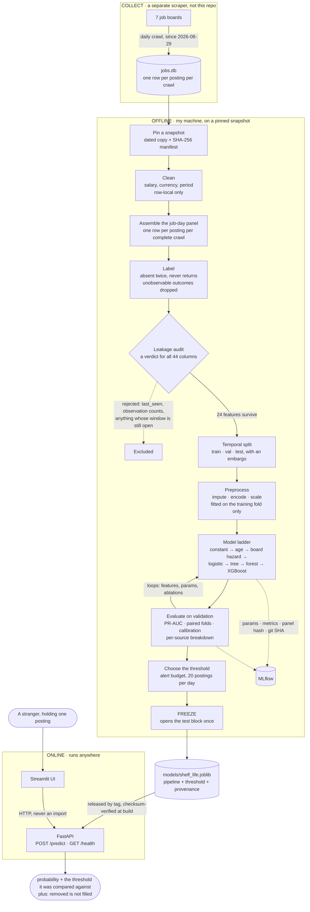

# shelf-life

[](https://github.com/professor3333/shelf-life/actions/workflows/ci.yml)

A job posting has a shelf life: it sits on a board until it is pulled. This
project predicts which postings on today's board will be gone within a week,
from a panel of postings collected daily by my own scraper, and serves the
prediction over HTTP — one posting at a time, or a whole board ranked. The
product is the ranking; a posting scored on the day it first appears is a case
the same model must handle and is measured on its own
([`reports/cohort_audit.md`](reports/cohort_audit.md), `docs/design.md` §15).

The label is **removed from the board**, which is not the same thing as
**filled**. The name of the project is chosen not to claim otherwise, and that
distinction is repeated everywhere a number appears — including on the screen of
the UI, and in every API response, which carries a `predicts` field that says
*removal from the board within N days — not filled* in so many words.

**One word for the label: removal.** This document, the model card, the API
and the UI say *removed*, *removal*, *disappearance*; never *filled*, *hired*
or *closed* as the name of the event. Where a code identifier or a generated
table still says `closure` — `closure_rate`, a `closures` column — it means
removal and nothing more; those names predate the rule and are being retired
as the files they live in are touched.

**That the label measures removal has been checked against the boards, not just
argued.** A sample of postings the panel calls removed was verified against each
source's live listing: **59 of 60 are genuinely gone under their own id** (98.3%,
95% Wilson 91.1–99.7%), against a control drift of 3.3% among postings that were
up at the last crawl. Twelve percent of those verified removals had their title
relisted under a new id within days — which is the caveat above, measured:
the posting left, the role did not. [`reports/label_check.md`](reports/label_check.md).

> **Status, stated plainly.** The full system is built: ingestion, labelling,
> the leakage audit, the temporal split, the model ladder, experiment tracking,
> the frozen-artifact packaging, the API, the container and the UI.
>
> **It is deployed, and it is serving no model.** The API answers at
> <https://shelf-life-5hin.onrender.com> and the UI at
> <https://shelf-life-2l8tanmdatboms9mhxh3rj.streamlit.app/> — both public, both
> free tier, both live as you read this. `/health` reports `degraded` and
> `/predict` returns 503, because `MODEL_TAG` names no release yet. That is the
> intended state, not an outage: see [Deployment](#deployment). One thing there
> is *not* intended: on 2026-09-11 the first automated look at the UI found it
> unable to reach the API — its `SHELF_LIFE_API` secret was never set on the
> host — and the `verify-ui` job stays red until it is.
>
> **No model has been fitted at H = 7 yet.** An honest three-way split needs
> more labelled crawl waves than the panel has, and choosing a model needs more
> still. [`reports/readiness.md`](reports/readiness.md) says how many, how far
> off, whether the panel is still accruing, and the projected dates;
> [`reports/test_results.md`](reports/test_results.md) records the refusal
> rather than a number. `scripts/watch_depth.sh` re-measures both daily.
> [Why, and when it clears](#why-there-is-no-test-number-yet).
>
> The ladder *has* run end to end on the real panel at H = 1, the pipeline smoke
> test, where nothing separates from the base rate
> ([`reports/model_comparison.md`](reports/model_comparison.md)). Those numbers
> describe the smoke test and are labelled as such wherever they appear.

**Where the numbers live.** The scraper runs daily, so every count, rate and
date in this project moves. The generated reports under `reports/` are the
authoritative values — each names the command that writes it and the snapshot
it describes — and this README links to them rather than restating them:

| question | report |
|---|---|
| Is the H=7 model ready; how far off; is the panel accruing | [`readiness.md`](reports/readiness.md) |
| The base rate, the label's stability, relisting, removals against lifespan | [`label_validity.md`](reports/label_validity.md) |
| Are removals real removals (checked against the boards) | [`label_check.md`](reports/label_check.md) |
| Does the label treat the initial stock and new arrivals alike | [`cohort_audit.md`](reports/cohort_audit.md) |
| Can the features name the board without `source` | [`board_fingerprint.md`](reports/board_fingerprint.md) |
| The ladder, folds, threshold, calibration, per-board and transfer | [`model_comparison.md`](reports/model_comparison.md) |
| The held-out result, or the refusal to produce one | [`test_results.md`](reports/test_results.md) |
| Every run that has ever been kept | [`depth_ledger.md`](reports/depth_ledger.md) |
| What the free instance's cold start measures, cycle by cycle | [`cold_start_baseline.md`](reports/cold_start_baseline.md) (the definitive `cold_start.md` does not exist yet) |

Where a number in this README carries a date, it is the value on that date and
is kept as the record of a decision, not as the current state.

---

## The pipeline, end to end

Where the data comes from, how it becomes a label, how a model is chosen, and how
a stranger gets a number back.



**The four things that diagram is really saying:**

1. **Everything left of the split is sealed at `t`.** A feature that would not
   exist at the moment of prediction is not a weaker feature — it is the answer,
   arriving early.
2. **The loop is between the ladder and validation, and it never touches test.**
   The test block is read in one place, once, after the threshold is already
   fixed.
3. **The object that is trained is the object that is served.** Not a
   re-implementation of the feature logic on the serving side — the same fitted
   `Pipeline`, in one file, with its threshold inside it.
4. **The UI talks to the API over HTTP, and the API holds no feature logic.**
   Each arrow across a boundary is enforced by a test, because a rule that
   depends on remembering is a rule that ends.

---

## Architecture

Two systems that share exactly one object: the fitted pipeline.

```
OFFLINE — runs on my machine, on a pinned snapshot
──────────────────────────────────────────────────────────────────────
  jobs.db          src/data/       src/features/      src/models/
  (scraper)   ──>  snapshot   ──>  assemble      ──>  ladder, tuning,
                   load            derive             evaluation
                   clean           preprocessing            │
                   archive              │                   │
                        │               │                   ▼
                        └── split ──────┴────────────>  freeze.py
                                                            │
                                                            ▼
                                              models/shelf_life.joblib
                                        (ColumnTransformer + estimator,
                                         threshold, metrics, provenance)
                                                            │
──────────────────────────────────────────────────────────────────────
ONLINE — runs anywhere                                      │
                                                            ▼
   app/streamlit_app.py  ──HTTP──>  api/main.py  ──>  the same object
        (a form)                    POST /predict      loaded once at
                                    GET  /health       startup
```

Three properties that shape everything else:

**The serving path uses the same fitted object as training.** Not a
re-implementation of the feature logic. A second implementation agrees on the
day it is written and drifts silently afterwards — that is training/serving
skew, which is leakage wearing a production hat. `api/` is forbidden by test
from importing `src.features`, `src.models` or `src.data`.

**The UI calls the API, never the model.** `app/` is forbidden by test from
importing `src/` at all. The alternative works fine on a laptop and means the
deployed UI and the deployed API are scoring with two different artifacts.

**Everything learned from data lives inside one scikit-learn `Pipeline`**, and
there is exactly one supported way to fit it — `fit_on_training_fold`, which
takes the split object and can only reach the training block. Fitting a scaler
on the whole frame is the most common way to fake a good score, and the way to
prevent it is to make the wrong call inexpressible rather than merely discouraged.

---

## Problem statement

**Informally.** A job board shows a list of things that all look equally
available, and they are not. Some will be gone this week; some have been sitting
there for two years and will still be there next spring. A board sorted by
"new" cannot tell you which is which, and neither can any single scrape — the
information lives in the *difference* between scrapes.

**Formally.** Let a posting `j` be observed by a complete crawl at time `t`.
Using only information sealed at or before `t`, estimate

```
P( posting j is absent from the board throughout (t, t + H]  |  information at t )
```

| | |
|---|---|
| **Task** | Binary classification, scored as a probability |
| **Unit** | A job-day: one posting as one complete crawl saw it |
| **Inputs** | 44 audited panel columns → 24 features once the leakage verdict is applied |
| **Output** | A probability, plus the threshold it is compared against |
| **Horizon** | `H = 7` days for the decision, chosen against a measured 1.69%/day hazard; `H = 1` retained as a pipeline smoke test |
| **Base rate** | Measured, not planned: **7.76%** at `H = 7` on the 2026-09-09 snapshot ([`docs/design.md`](docs/design.md) §2, where the ≈11% planning estimate it replaced is also recorded); about 1% at `H = 1`. The live figures are in the generated reports — [`reports/model_comparison.md`](reports/model_comparison.md) for the panel a comparison ran on — and are not restated here |
| **Constraint** | Every feature must exist at `t`, and be suppliable by a caller holding one posting |
| **Success** | Beat three baselines — the base rate, `age_days` alone, and a per-board hazard — by a margin that survives fold variance |

**Why it is harder than it looks.** Four difficulties, none of which are about
model choice:

1. **The label is a measurement, not an observation.** "Disappeared" is only
   evidence of removal if the crawl saw the whole board that day. For 78% of the
   collected postings it did not, and the label meant something else entirely.
2. **The outcome is censored at both ends.** Postings first seen recently have
   not had time to be removed; postings already present when collection began had been
   open for an unknown time.
3. **Positives are rare and the panel is short.** 96 positives across 6,874
   labelled rows at `H = 1` means differences of a few points sit inside the
   noise. A longer horizon buys a healthier base rate and costs another week of
   censoring at each end — which is the trade `docs/design.md` §2 records.
4. **Missingness fingerprints the source.** "Salary is missing" is very nearly a
   synonym for "this row came from arbeitnow" — so the strongest signal available
   is partly a fact about the collector rather than about the world.

Each of these is unpacked below, and each is the reason for a decision recorded
with a date in [`docs/design.md`](docs/design.md).

---

## Approach

**Classical ML on tabular data, deliberately.** Gradient-boosted trees remain the
thing to beat on problems of this shape, and the difficulty here lives in
labelling, leakage and evaluation rather than in representation. A neural network
would let all three be skipped and hide the skipping behind a good-looking loss
curve.

Eight steps, in the order they were done. Each links to its detail below.

| # | Step | The discipline that makes it honest |
|---|---|---|
| 1 | **Pin a snapshot** | The scraper runs daily, so "the data" moves. Every experiment reads a dated, hashed copy — never the live database. |
| 2 | **Define the label once, in code** | Two consecutive absences, final at that moment even if the posting later returns (`docs/design.md` §11); unobservable outcomes dropped rather than called negative. Sources whose crawls were truncated carry no label at all. |
| 3 | **Assemble a job-day panel** | One row per (posting, complete crawl), every feature sealed at `t`. |
| 4 | **Audit before modelling** | A written verdict for all 44 columns, enforced by a test — a column with no verdict raises rather than being silently used. |
| 5 | **Split on time, with an embargo** | A strip wide enough that no training label was computed from the evaluation period. |
| 6 | **Climb a ladder** | Constant → `age_days` → per-board hazard → logistic → tree → forest → XGBoost, comparing *paired* fold differences rather than two averages. |
| 7 | **Choose an operating point** | A threshold from an alert budget, plus calibration, plus a per-source breakdown. |
| 8 | **Freeze one object, serve it unchanged** | The artifact is the whole fitted pipeline; the test block is opened once, after freezing. |

**The rung that matters is not the top one.** The ladder exists to find out
whether complexity buys anything on this problem. If the forest ties the logistic
regression, that is a finding about the data and it gets written down rather than
tuned past — which is exactly what the comparison machinery reports today on a
label known to be pure noise.

**Three rules are enforced by tests rather than by intention**, because a
discipline that depends on remembering is a discipline that ends:

- the preprocessing pipeline has exactly one supported fit path, and it can only
  reach the training block;
- `api/` may not import `src.features`, `src.models` or `src.data`, and `app/`
  may not import `src/` at all;
- the test split is readable in exactly two places, and a parser over `src/`
  fails the build if that changes.

**What is deliberately not attempted:** deep learning, embeddings over the
description text, scraping more sources to repair the data, retraining and drift
monitoring, authentication. The mess in this data *is* the problem being solved;
fixing it upstream would delete the thing worth learning.

---

## The problem

**Who would use this, and what changes because of it.** Someone who tracks a
board — a recruiter watching competitor postings, a candidate deciding what to
apply to first, an analyst measuring hiring activity — and can only act on a
handful of postings a day. The prediction orders a list: *these are the ones
about to disappear.*

That user is why the metric and the threshold are what they are. They have a
budget of about **20 postings a day** they will actually look at, so the model
is scored on the quality of a short list, not on the accuracy of a verdict about
every row.

### What is predicted, exactly

> Will this posting be **absent from the board** within `H` days of an
> observation of it, judged from information available at the moment of that
> observation?

One row is a **job-day**: one posting as seen by one complete crawl. A posting
present for five complete crawls contributes five rows, each with its own
features and its own label. (This is the person-period setup used in
discrete-time hazard models; `docs/design.md` §8 records why it was chosen over
one row per posting.)

The label is positive when the posting is absent from a complete run and still
absent from the run after it. Two consecutive absences rather than one, because
a single missed crawl is as likely to be a hiccup as a removal — and **the label
is final at that moment**: a posting that returns after two absent runs keeps
it. That bound is what makes the embargo's arithmetic true, and it costs one
posting in 1,530 (`docs/design.md` §11, decided 2026-09-09). The scan for those
absences starts at the posting's first sighting, not at the panel's first run —
the runs before a posting existed are not absences (`DEBUGGING.md`, 2026-09-11).

**Rows whose outcome is not yet observable are dropped, not labelled zero.** A
posting first seen yesterday has not had time to be removed; calling that a negative
teaches the model that recent means open, which is a labelling bug that produces
a beautiful score. `python -m src.features.assemble` prints how many rows are
dropped for this reason on every build; the dated table under
[The data](#the-data) shows one snapshot's figures.

### The prediction point

```
              Posting observed by a crawl at time t
                              │
                  INFORMATION AVAILABLE AT t          ← features
                              │
        ──────────────────────┼──────────────────────  the prediction point
                              │
                           MODEL
                              │
                        PREDICTION
                              │
                   What happened after t             ← the label, or leakage.
                                                       There is no third
                                                       category.
```

Every feature is a fact sealed at or before `t`: the tabular fields come from
that run's own snapshot CSV, the structured detail from that fetch's archived
payload, and the three board-context features from a window that ends at `t`.
`docs/leakage_audit.md` gives a verdict for all 44 panel columns, and
`src/features/preprocessing.py` **is** that document as data — a column with no
verdict raises rather than being silently modelled or silently dropped.

**Which rows get scored is a decision, and it is made** (`docs/design.md` §15).
The product ranks a day's *whole* board — the postings already up when
collection began and the ones that appeared since — so both are in the dataset
and age is a feature. That is only legitimate if the label treats the two
populations alike, which is what `python -m src.data.cohort_audit` checks:
[`reports/cohort_audit.md`](reports/cohort_audit.md) separates incumbent stock
from incident flow, cuts every rate by first-seen wave, board, and runs seen as
of `t`, shows what `age_days` alone can rank on each slice, and scores the
first-observation rows — a posting on the day it appears — on their own. On
the label of 2026-09-09 to 09-11 that file's first verdict would have read
*"the label is not indifferent to cohort"* in one sentence; it was a bug
(`DEBUGGING.md`, 2026-09-11), and the audit exists so the next one is a table
rather than a week.

---

## The data

Collected by my own scraper (a previous project) into a SQLite database, and
copied here as an immutable dated snapshot before anything reads it. The scraper
keeps running, so "the data" is a moving target; numbers computed on different
days are not comparable unless the snapshot is pinned.

**Snapshot 2026-09-06** — 5,712 postings, 22,703 observations, 103 crawl runs,
window 2026-08-29 → 2026-09-06.

The job-day panel built from it, at `H = 1`:

| | |
|---|---|
| job-days | 8,040 |
| labelled (outcome observable) | 6,874 |
| dropped (right-censored) | 1,166 |
| positives | 96 (**1.40%**) |
| distinct postings | 1,262 |
| complete crawl waves | 7 (6 of them labelled) |

Per source, on the labelled rows:

| source | rows | postings | positives | rate |
|---|---|---|---|---|
| greenhouse:anthropic | 3,488 | 645 | 50 | 1.43% |
| greenhouse:gitlab | 1,353 | 251 | 24 | 1.77% |
| greenhouse:figma | 959 | 167 | 10 | 1.04% |
| greenhouse:duolingo | 523 | 94 | 5 | 0.96% |
| greenhouse:discord | 298 | 54 | 6 | 2.01% |
| python_org | 157 | 33 | 1 | 0.64% |
| greenhouse:airtable | 96 | 16 | 0 | 0.00% |

### What is broken in it, and what was done

**The largest source is excluded, and that is the most important fact here.**
arbeitnow is 4,450 of the 5,712 postings — and every one of its crawls in the
current rules epoch stopped at its page cap without observing the whole board.
A posting's absence from a partial crawl is not evidence of removal; it may
simply have fallen past page 8. Treating those absences as removals would have
manufactured thousands of false positives, and the label would have been
measuring pagination. So `complete_runs` admits only crawls that finished, which
leaves the six Greenhouse boards and python_org. The defect is recorded in
`DEBUGGING.md`; it cost three quarters of the dataset and it was the right
trade.

**Missingness is a fingerprint of the source, not noise.** `remote` is never
populated on Greenhouse and always populated on arbeitnow. `first_published`,
`departments` and `content_chars` are null on exactly the 157 python_org rows.
So an "is this missing?" indicator on any of them reconstructs board identity
for free — which is a decision the project has *not* yet made (`docs/design.md`
§4), so no such indicator exists. Each column's fill and the reason for it are
recorded next to the code that applies it, in `src/features/preprocessing.py`.

**Salaries are text in mixed formats and currencies** — `"90.000 € bis
130.000 €"`, `"$150k-$200k"`, and nothing at all on three quarters of postings.
`src/data/clean.py` parses what it can; `salary_stated` carries the fact of
absence as its own feature, because a posting that declines to state pay is
telling you something.

**Postings come back from the dead, and the label now stops waiting for them.**
Of 1,530 postings, 145 vanished and returned: 144 after a single absent run,
which the two-run corroboration rule already refuses to call a removal, and
**one** after two. None has ever returned after three. So a label is final the
moment corroboration is satisfied (`docs/design.md` §11, decided 2026-09-09),
which mislabels that one posting — 0.065% — and makes the embargo's arithmetic
true. The clause it replaces read the whole remaining panel, so the reach was
unbounded and no embargo of any width could seal a training label from the
evaluation period.

---

## Leakage: what was found

The panel is unusually rich in traps, because half its columns are written
*after* the outcome. Three worth naming:

**`n_observations_total` and `days_on_board_total`.** A count of how many times
a posting was seen accumulates *because* the posting stayed open. It is the
label with a numeric face. These live in `src/features/leaky.py`, deliberately
kept and deliberately quarantined: run `06-xgboost_leaky` admits them and run
`07-xgboost_leak_removed` takes them away again, so the experiment history
contains a *measured* leak rather than a description of one.

What it is worth, measured on a fixture whose label is drawn independently of
every feature — so the honest answer is known to be the base rate, 0.10:

| run | validation PR-AUC |
|---|---|
| `06-xgboost_leaky` | **0.8385** |
| `07-xgboost_leak_removed` | **0.1915** |

**The leak was worth +0.6471 PR-AUC, and every point of it was a lie.** A model
that could not possibly know anything scored 0.84 because one column counted how
many times the posting had been seen. That pair is the run that changes your
mind about a feature, and it cannot be reconstructed after the fact — which is
why the leaky columns are kept in the repository rather than deleted.

**Any statistic fitted before the split.** `CompanyVolumeEncoder` counts a
company's postings — computed over the whole frame, each row's encoding would
depend on rows in the validation and test blocks. It is a fitted transformer
learned on the training fold only, and `learned_statistics()` exposes the fill
values so "was this fitted on the training fold?" is an assertion rather than an
assurance.

**`t_dow`, `n_complete_runs_observed`, `source_id`.** Excluded as axis proxies.
With five crawl waves, day-of-week nearly identifies the wave; `source_id` is
monotonic in creation order (ρ = 0.917 against `first_published`); the
observation count is constant at serve time and encodes left truncation.

**Board identity, which was excluded and is still there.** `source` and
`company` are out so a posting from a board never scraped can be scored. A
classifier fitted on the production feature matrix — same `Pipeline`, target
swapped for `source` — **names the board for 100% of validation rows**
([`reports/board_fingerprint.md`](reports/board_fingerprint.md)). Not through
missingness, which alone scores 19%, but through values: `board_size_at_t` is a
board's name in integer form (100% on its own), and each employer's office
cities and posting template carry it redundantly (97.6% with every
board-context column removed). On seven boards, any feature set rich enough to
describe a posting identifies its employer, so matrix neutrality was the wrong
criterion. `docs/design.md` §4a allows availability patterns and template
features explicitly and makes **transfer** the criterion instead: the
leave-one-board-out table in `model_comparison.md` is read before any freeze,
and a held-out board whose score collapses to its base rate is a candidate not
to freeze.

---

## Method

### The split

**Temporal, with an embargo.** Train on the earliest window, validate on the
middle, test on the most recent — cut on calendar time, never on run index,
because run indices are per-source and not aligned.

The scenario it simulates, in one sentence: *a model fitted on every posting the
board showed us up to some Monday, scoring the postings that are on the board on
a later day it has never seen.*

The embargo is the part most temporal splits omit. A row's label reads forward —
`H` days plus one run for the corroborating absence — so without a discarded
strip between blocks, the training labels were computed from the validation
period. On this data the embargo is **2 days 10 hours**: one day of horizon plus
the widest observed gap between consecutive runs, 34.4 hours, caused by a single
crawl that fired at 14:07 instead of 03:45.

Postings deliberately appear in more than one block: 91% straddle any mid-panel
cut, and a grouped split would discard most of the data to defend a rule
imported from the IID setting. The risk that replaces it is memorisation, so
every evaluation row is tagged `seen_in_train` and every metric is reported both
overall and split on that flag. A model that scores well on carried-over
postings and badly on unseen ones has memorised.

The test block is opened **once**, in `src/models/freeze.py`, after the pipeline
and threshold are frozen. `tests/test_evaluate.py` parses `src/` and fails if the
test split is read anywhere but there and in the property that defines it.

### The metric

**PR-AUC, with precision and recall at a chosen threshold.**

*Not accuracy.* At a base rate of 1.40%, predicting "stays open" for every
posting scores **98.6%** and has told you nothing.

*Not ROC-AUC.* With rare positives it flatters. The false-positive rate divides
by the true-negative count — 7,937 of them against 100 positives — so a model can
raise a great many false alarms without visibly moving the x-axis. Precision
divides those same false alarms by the number of rows *flagged*, where they
cannot hide. At this base rate the ROC curve describes a decision nobody makes.

Brier score and expected calibration error are reported alongside, because a
probability that is not calibrated is a score wearing a percent sign — and
because a constant predictor is perfectly calibrated and completely useless,
calibration is never reported on its own.

### The threshold

Not 0.5. The operating point is set by the **alert budget**: 20 postings per
prediction day, the number a person will actually read. The threshold is the
score at which exactly that many rows are flagged, chosen on the validation
block and then frozen inside the artifact — a probability shipped without the
threshold it is compared against is not a decision.

The cost asymmetry behind it: a false positive costs a few seconds of attention
on a posting that was not going anywhere. A false negative costs a missed
posting entirely. Recall is worth more than precision here, but only up to the
budget — a list of 500 alerts nobody reads has perfect recall and zero value.

---

## Why there is no test number yet

**At H = 7, the horizon this build is about**, an honest three-way split needs
more labelled crawl waves than the panel has, and a model *choice* needs more
still — the two gates are not the same day. The counts, the shortfall and the
projected dates are measured, not planned, and they move: a missed crawl widens
the embargo for the whole panel and pushes both later.
[`reports/readiness.md`](reports/readiness.md) is the current answer.

At H = 1 — the pipeline smoke test, and `docs/design.md` §2 calls it that — the
same arithmetic needs eight waves, the panel reached eight on 2026-09-09, and
the ladder ran. Everything in this section below describes that run. It is worth
reading because it is the machinery working on real data for the first time, and
worth not mistaking for a result about job postings at the horizon that matters.

```
minimum waves = 1 + 2 × (floor(embargo ÷ spacing) + 1) + corroboration runs
              = 1 + 2 × (floor(2d10h ÷ 1d) + 1)        + 1
              = 8
```

Each of the two block boundaries discards every wave inside the embargo — three
of them — and the wave landing exactly on a boundary goes too. A wave is also
not labelled the day it is crawled: negatives need a later run to confirm
survival, positives need two.

That last clause is the final term, and it is easy to miss. A wave becomes
labelled one run before its positives become observable, so **the newest
labelled wave always has zero positives** — measured on this snapshot, 1,160
labelled rows and not one removal, against 14–22 in every wave before it. The
test block sits at exactly that end of the panel, and `src/data/split.py`
refuses a test block with no positives, so the split has to reach back past the
blind wave.

**A legal split is still not an evaluable one.** At eight waves the only cut
leaves a one-wave training block, and rolling-origin folds are cut from the
training window — a single wave yields none, so every model comparison would be
one number with no error bar, on a sample where the difference between two
models is smaller than the noise. Folds start at eleven labelled waves and
reach three at thirteen. `depth_report` states both waits, and they are not the
same day.

So `src/models/freeze.py` refuses — on **two** separate checks, because
legality arrived five days before evaluability and for that whole gap only the
first of them would have fired. `SplitTooShallow` asks whether a three-way cut
is legal. `NoFoldEvidence` asks whether anything could have *chosen* the model
being tested. Both exit 3 and write the reason into `reports/test_results.md`
instead of a number. A third, `DirtyWorktree`, is asked last and is about the
code: a real freeze from a tree with uncommitted changes exits 4 and writes
nothing, because the commit it would record could not reproduce the result
([Freezing a model](#freezing-a-model)).

The second check is the one that matters right now, and it was added on
2026-09-09 after the first opened. Between those two dates
`python -m src.models.freeze --run 05-xgboost_engineered` would have run: it
would have opened the held-out block against three positives, to measure a model
that no comparison had selected, and written a README figure with a decimal point
and nothing behind it. Every gate upstream declined in that window — the
rehearsal stops at validation, the watch reports a shortfall — and this one, the
only irreversible step, waved it through.

`--accept-no-folds` overrides it. The fold count then travels on the artifact as
`selection_folds`, so a served probability whose model was chosen by nothing can
say so at the endpoint.

**What the real runs have found.** The ladder first ran on the real panel on
2026-09-09, on validation only, with no error bars, and nothing separated from
the base rate. The label bug of 2026-09-11 (`DEBUGGING.md`) landed the same
day, so the run that stands is the one on the corrected label —
[`reports/model_comparison.md`](reports/model_comparison.md), which is
regenerated by `scripts/rehearse.sh` and carries the current table. Its
reading has not changed: nothing separates from the base rate, and the best
rule an age column could support matches gradient boosting with the whole
feature set. Whether that survives fold variance is exactly what the missing
folds would say, which is why
`reports/model_comparison.md` records **no verdict**: with nothing to select on,
naming a winner would be selection on the validation block.

**The leak reproduces on real data**, not only on the fixture. Run 06 admits the
panel-wide aggregates and scores 0.0290; run 07 removes them and returns to
0.0226 — the same number as run 05, which differs in nothing else. The leak was
worth +0.0064 PR-AUC, about a quarter of the honest score.

**What is verified in the meantime.** Every component is exercised end to end on
a synthetic panel whose label is drawn *independently of every feature*, so the
correct answer is known: nothing should beat the base rate. The comparison
machinery agrees — it reports the random forest leading the logistic regression
by 0.06 PR-AUC across seven rolling-origin folds and still returns the verdict
*"inside one standard deviation, so treat them as tied."* That refusal, on a
label that is pure noise, is the machinery working.

**The ladder starts with rules, not models.** Two of its rungs are a sentence
each — *a posting up more than a month is not about to be removed*, *fresh postings
move* — and a third bounds what any age-only rule could buy, by binning age into
deciles and predicting each bin's training rate rather than fitting a monotone
curve through it. `reports/baseline_results.md` compares the best model against
the best rule at the alert budget and says which won, because "XGBoost beats
logistic regression" is a statement about scikit-learn and this one is not.

The first rule is already known to be false here: postings older than 30 days
are removed at 1.30% against 1.14% for younger ones, and the rate across age buckets
runs 1.13%, 1.59%, 0.86%, 1.49%, 1.77%, 0.82% — flat and non-monotone. It stays
in the ladder because a plausible belief that the data refuses is a result, and
a reader who holds it is better served seeing it priced than not finding it.

### Would it work on a board it has never seen?

The per-source breakdown scores each board with a model **fitted on it**, which
answers *does it work here*. `reports/model_comparison.md` also answers *would it
work somewhere new*, by holding a whole board out of the fit and scoring its rows
twice — once with a model that never saw it, once with a model that did. The gap
is what board-specific learning was worth.

The control matters: base rates run from 0.0090 on figma to 0.0173 on discord,
so a low transfer score alone could be the board being harder rather than the
model failing to carry over.

**It cannot run yet, and the refusals are stated rather than hidden.** Positives
per board are anthropic 52, gitlab 24, figma 10, discord 6, duolingo 5,
python_org 3, airtable 0 — so testing on duolingo means five positives and
airtable's fold is undefined, while holding out anthropic removes half the
training positives and changes the fit and the board together. A board is scored
only when it keeps enough positives to measure and leaves enough behind to fit
on; every other board appears in a table of refusals with its reason.

### `POST /rank` — the shape the operating point was designed for

The frozen threshold is the score at which exactly `budget` postings are
flagged: a **rank statistic** taken over a day's board. `POST /predict` applies
that number to one posting in isolation, which is coherent but is the degenerate
case. `POST /rank` takes a list and returns each posting with its probability,
its rank, and a `watch` flag for the top `budget` — the "inspect the top 20"
workflow the alert budget already describes, without the caller reimplementing
it.

```
                    frozen pipeline
                          │
              ┌───────────┴───────────┐
          /predict                  /rank
        one posting              many postings
              │                       │
        probability            probability + rank
              │                       │
        watch decision          top-N watch list
```

Three properties worth stating, because each is a decision:

- **One scoring path.** Both endpoints share the same fitted pipeline object and
  the same `build_row`; `/rank` differs only in scoring a whole frame in one
  `predict_proba` call, which at 1,000 postings costs 4.8 s against 18.4 s for a
  loop. The two agree to about 6e-17 — the order of floating-point reductions,
  nothing else — and a test pins that.
- **`threshold_source` is always reported.** `frozen` is the model's calibrated
  operating point; `batch_budget` is this batch's budget-th score, a property of
  what was submitted rather than of the model. They differ, and neither is
  silently substituted for the other.
- **Board context is imputed, not derived from the batch.** A submitted batch is
  not the board: letting fifty postings manufacture `board_size_at_t = 50` would
  hand the model a value from a distribution it never saw, and unlike a missing
  value — which the training fold's imputer handles — that one is confidently
  wrong.

The batch cap is **250 postings**, from measurement rather than taste: 1.42 s on
a full core, ~23 s at the free instance's 0.1 vCPU, ~55 s worst case if the
request also wakes a sleeping container, against the 90 s stop rule. A day's
board is ~1,150 postings, so a full day is deliberately several pages.

**When the headline number arrives it will carry an interval.** PR-AUC,
precision, recall, Brier and ECE each get a 95% interval from resampling
**postings, not rows** — the panel is one row per (posting, crawl) at about six
rows per posting, so rows are not independent draws. With roughly twenty
positives in the test block, the width is the part worth reading: an interval
spanning the baseline means this test set could not tell the model from the
baseline, which is a fact about the sample size rather than a failure of the
model.

**The one real number that exists** is the constant-predictor reference: PR-AUC
**0.0140** on 6,874 labelled rows, which is the base rate. Every model must beat
it, and none has been asked to yet.

**What moved on 2026-09-06.** The sixth labelled wave arrived and the refusal
changed shape with it: `freeze` used to report an empty *validation* block, and
now reports an empty *test* block. Train and validation are both populated on
the best candidate cut — 1,104 training rows with 19 positives, 1,159 validation
rows with 22 — and what is still missing is a test block on the far side of the
second embargo.

**Corrected 2026-09-07.** This section said *one* labelled wave short until the
depth arithmetic was rechecked against the acceptance check it is supposed to
predict. It was counting only the embargo's geometry and not the blind wave at
the tail, so the seventh wave would have arrived, the split would still have
been refused — for no positives in the test block — and the plan would have
been wrong by a day. Two waves short for a legal split, seven for one that can
carry an error bar. `DEBUGGING.md` has the entry.

---

## What happens on the day it clears

**The rehearsal comes first, and it is not the same day.** A legal split arrives
before one deep enough to cut rolling-origin folds from, so the first real split
carries no error bars — which is exactly the split not to spend the test block
on. `scripts/rehearse.sh` runs the ladder on that split, on **validation only**:

```bash
./scripts/rehearse.sh --check   # report the depth, run nothing
./scripts/rehearse.sh           # snapshot, assemble, gate, then the ladder
```

It pins a snapshot, rebuilds the panel, asks `feasible_cuts` whether a cut
exists, and either declines with exit 3 — *not yet* is not an error — or runs
`train_baseline`, `train`, `experiments` and `evaluate`. It never invokes
`freeze`, and a test asserts so by parsing the script rather than trusting the
comment that says it.

What that buys is a dress rehearsal on real data. Every one of those modules has
so far only run against `tests/panels.py`, whose columns are synthesised; the
first contact with the real panel is where a dtype or an empty group shows up,
and meeting that on a split whose numbers do not matter yet is much better than
meeting it on the one afternoon the test block is available.

**Every run is kept, not overwritten.** `reports/depth_ledger.md` — rendered
from a committed `depth_ledger.jsonl` — holds one row per run: the snapshot, the
commit, the labelled waves, the positives, the folds, and the metric with its
fold spread. `evaluate` and `freeze` append to it automatically.

It exists because of a fact this project cannot argue its way out of. The panel
accrues removals at a rate of tens a day — the ledger states it — so the first
honest result will carry an interval wide enough to swallow most differences
between models.
That is the finding, not an excuse — and the only way to show it as one is to
keep the earlier runs and let a reader watch the interval narrow against a
sample size printed beside it. A metric at one depth is a claim; the same metric
at four depths is evidence about what the claim is worth.

Re-running on the same snapshot with the same commit replaces a row rather than
adding one, so the ledger measures what the pipeline scored and not how often it
was run. Synthetic runs are tabled separately and labelled, because a history
that mixed them with real ones would be worse than no history.

### The two gates, and they are not the same day

At **H = 7**, the horizon this build is about, the first gate is **a legal
split** — the rehearsal runs, with real numbers and **no error bars** — and the
second, days later, is **three rolling-origin folds** — a comparison that can be
believed, and §12 can close. The labelled-wave count each needs, the shortfall,
and the projected dates are in
[`reports/readiness.md`](reports/readiness.md), regenerated by every watch;
they move because the embargo is the horizon plus the widest observed run gap,
so one late crawl widens it for the whole panel. Roughly nine waves burn at
each boundary at H=7 against daily crawls, rather than three at H=1 — and H=1 is
a smoke test.

Eight rather than seven: a removal needs corroboration at two consecutive later
runs, so the newest labelled wave structurally cannot hold a positive and a
seven-wave split is refused for having no positives in the test block. That
arithmetic was wrong in this repository until 2026-09-07 and `DEBUGGING.md`
records it; `python -m src.data.split` reports the current shortfall.

Then the sequence is fixed, and every step already has a command that runs today
and refuses honestly.

```bash
python -m src.data.snapshot                    # pin a dated, hashed copy
python -m src.features.assemble                # rebuild the job-day panel from it
python -m src.data.profile                     # regenerate the data profile
python -m src.data.label_audit                 # does "disappeared" mean what the label needs?
python -m src.data.cohort_audit                # does the label treat stock and flow alike?
python -m src.models.board_fingerprint         # can the features name the board without `source`?

python -m src.models.train_baseline            # the ladder: rules, then fits
python -m src.models.train                     # ablations, incl. the §12 board-context folds
python -m src.models.experiments               # replay the history on the real panel
python -m src.models.evaluate                  # compare, threshold, calibrate — validation only
python -m src.models.ledger                    # re-render the depth ledger from its jsonl

python -m src.models.freeze --run <spec>       # opens the test block, once

python -m src.inference.fetch --checksums models
gh release create artifact-<date> models/*     # the model becomes a version
echo artifact-<date> > MODEL_TAG && git push   # committing the tag is the deploy
./scripts/await_release.sh <url> artifact-<date>   # wait for that tag to be serving
./scripts/smoke.sh <url>

./scripts/cold_start.sh <url> 16               # the gate that can fail — see below
                                               # (three cycles; writes reports/cold_start.md)
```

The blank lines are the point. Data, then modelling — which touches
**validation only** — then `freeze` alone, then release and deploy, then the
cold-start gate. `freeze` sits by itself because it is the only line in the
project that reads the test block, and it happens after the threshold is chosen
and before anything is published.

**`cold_start.sh` runs last, and it is a gate rather than a report.** It has to
come after the deploy, because it measures a real instance waking from idle with
the real artifact loaded — there is nothing to time until the tag is serving. So
it is the one check whose failure arrives *after* the thing it judges is live,
and the answer to a failure is a rollback (`docs/deploy.md` §5, one commit) and a
reassessment, not a wider timeout: past 90 seconds the script exits non-zero and
the rule is *reassess the architecture, do not raise the timeout*.

The baseline is in `reports/cold_start_baseline.md`, and it is a floor rather than
an estimate — whatever unpickling the pipeline costs on 0.1 vCPU is exactly the
part an image with no model could not measure. What the definitive run has to
contain — real artifact, first `/predict` and `/rank`, the unpickle and memory
from inside the process, repeated cycles, the criterion — is a table in
`docs/design.md` §7e, and the script produces every row of it.

The last two lines are the whole of the deployment, because the path around them
already exists: [`docs/deploy.md`](docs/deploy.md) has the one-time cloud setup,
the rollback and the teardown.

Then the three decisions that have been waiting on real numbers rather than on
thought — whether `source` is a feature, how wide the resurrection window is, and
what to do about board context a caller cannot supply — get settled in
`docs/design.md` with the numbers that settled them. Then the artifact is tagged,
released, and fetched into an image by tag.

**The order is not negotiable.** `freeze` is the only step that reads the test
block, it happens after the threshold is chosen, and nothing downstream of it may
change either. A disappointing number there is evidence about the validation
discipline, not a licence to tune — the tuning would be selection on test, and
the next number would mean less than the first.

---

## What is here

Only features that exist:

- **Reproducible ingestion** — pin a dated snapshot of the scraper DB, load it
  with schema validation and dtype coercion, recover as-of-`t` fields from
  archived API payloads. Delete `data/processed/`, re-run, get identical output.
- **A labelled job-day panel** with the censoring rule in one place, in code.
- **A leakage audit** covering all 44 panel columns, enforced by a test that
  refuses a frame carrying a column no verdict has been written for.
- **A leakage-safe pipeline** — imputation, encoding and scaling inside a
  `ColumnTransformer` with exactly one supported fit path. Unseen categories at
  serve time encode as zeros rather than raising.
- **A model ladder** — constant → logistic → decision tree → random forest →
  XGBoost — compared with fold variance and *paired* fold differences, not by
  subtracting two averages.
- **Hypothesis ablation** — each engineered feature was a hypothesis before it
  was a column, and is removed one at a time to see what it was worth.
- **A deliberate overfit** — depth up and regularisation off until train and
  validation separate, then closed again one knob at a time.
- **Label verification against the source** — postings the panel calls removed
  are checked against each board's live listing, with a control arm, because
  agreement on the positives alone is compatible with an instrument that answers
  *gone* for everything.
- **Diagnostic figures** — missingness by source, the long-tailed distributions,
  a precision–recall curve against the base rate, calibration per rung, and
  train against validation across model complexity. Written to
  `reports/figures/` beside the reports that cite them, and logged to MLflow
  with the panel's sha256 and the git SHA that drew them.
- **MLflow tracking on every experiment** — the eight scripted runs *and* the
  five families the training entry point runs each time: the ladder, the
  ablations, the overfit sweep, the board-context folds and the serve-time
  regime. Each is a parent run
  with one child per variant, and each child records the feature subset it
  actually fitted on, both cut instants and the embargo, the panel's sha256, its
  own parameters and metrics, and the git SHA. There is a replay path that
  reproduces a run from what was logged rather than from a fresh search.
- **A frozen artifact** — the whole fitted pipeline plus threshold, metrics and
  provenance in one file, with a load-time check that it really is the pipeline.
- **A FastAPI service** — `POST /predict`, `GET /health`, `GET /contract`.
- **A Streamlit UI** over that service, over HTTP.
- **A Docker image** — non-root, `$PORT`-aware, health-checked.

Not here, and deliberately: deep learning, NLP beyond title-derived features,
retraining pipelines, drift monitoring, authentication. Each would be a
different project.

---

## Tech stack

Python 3.12 · pandas · numpy · scikit-learn (`Pipeline`, `ColumnTransformer`) ·
XGBoost · MLflow · matplotlib · FastAPI · pydantic · Streamlit · Docker · pytest · ruff ·
SQLite (read-only, upstream) · Parquet.

---

## Project structure

```
shelf-life/
├── src/
│   ├── data/         snapshot.py load.py clean.py archive.py profile.py split.py
│   ├── features/     assemble.py derive.py preprocessing.py leaky.py
│   ├── models/       metrics.py baselines.py train_baseline.py train.py
│   │                 evaluate.py experiments.py freeze.py provenance.py
│   └── inference/    contract.py artifact.py predict.py fetch.py
├── api/              main.py schemas.py
├── app/              streamlit_app.py client.py
├── scripts/          smoke.sh await_release.sh cold_start.sh
├── render.yaml       the API service, as configuration rather than clicks
├── MODEL_TAG         which release is deployed; empty until one exists
├── requirements.txt  what the UI's host installs — and nothing that loads a model
├── tests/            the suite — no network, no data files
├── docs/             problem_definition.md design.md leakage_audit.md
│                     data_dictionary.md deploy.md
├── reports/          generated: profile, baselines, model results, comparison,
│                     experiment log, test results, feature hypotheses
├── data/             not committed — snapshots and derived frames
├── models/           not committed — the frozen artifact
├── Dockerfile        .github/workflows/  ci.yml verify-deployment.yml
├── pyproject.toml    what the code needs — lower bounds and extras
└── uv.lock           what it actually runs against — every package, hashed
```

`docs/` holds decisions and audits, written by hand. `reports/` holds generated
output — regenerate rather than edit; each file names the command that writes it.

---

## Requirements

- Python 3.12 — one version, not a range. It is what the lock resolves for,
  what CI runs, what the dev container provides and what the serving image
  unpickles the artifact under; a test asserts all five agree.
- [uv](https://docs.astral.sh/uv/), which installs the locked environment
- Docker, to build the image
- **For the data pipeline only:** the scraper's SQLite database. Without it, the
  ingestion commands have nothing to read; everything else — tests, API, UI —
  runs without it.

---

## Installation

```bash
git clone https://github.com/professor3333/shelf-life.git
cd shelf-life
uv sync --locked --extra dev --extra api --extra ui
source .venv/bin/activate
```

`uv sync --locked` installs exactly what `uv.lock` names — every package, at the
version and hash the lock records — and refuses if the lock has fallen behind
`pyproject.toml`. The same command, on the same lock, builds CI's environment
and the serving image's, so the scikit-learn and XGBoost that freeze a model are
the ones that unpickle it. The lock is committed; its sha256 travels on every
frozen artifact as `lock_sha256`. Change a dependency in `pyproject.toml`, run
`uv lock`, and commit both.

The extras are separable on purpose: `api` for the service, `ui` for the form,
`tracking` for MLflow, `plots` for the diagnostic figures, `dev` for everything
plus the test tooling. Running the model ladder should not require installing a
web framework — and `plots` is separate for a sharper reason: the Dockerfile
installs the `api` extra alone, so a plotting library in the base dependencies
would ship to a 0.1-CPU instance, draw nothing, and be paid for on every cold
start. A test asserts it stays out.

---

## Usage

Every command below was run against this repository before it was written down.

### The offline pipeline

```bash
python -m src.data.snapshot                    # pin a dated copy of the scraper DB
python -m src.data.load                        # validate it into Parquet
python -m src.data.archive                     # recover as-of-t fields from payloads
python -m src.data.profile                     # write reports/data_profile_<date>.md
python -m src.features.assemble --horizon 1    # build the job-day panel
```

### Models

```bash
python -m src.models.train_baseline            # the ladder and the reference number
python -m src.models.train                     # engineered features, XGBoost, ablation
python -m src.models.train --no-mlflow         # the same, without the tracking extra
python -m src.models.evaluate                  # comparison, threshold, calibration
python -m src.models.experiments --synthetic   # replay the run history into MLflow
mlflow ui --backend-store-uri sqlite:///mlflow.db
```

The first three now run on the real panel and write real validation numbers.
They stop short of a verdict while the training window yields no fold, which is
the expected output today, not a failure.

`src.models.train` logs everything it runs. MLflow is an optional extra, so a
base install has none of it — in that case the run still produces its report and
says, in the report itself, that it was not tracked. `--no-mlflow` skips it
deliberately and is recorded the same way. An untracked run that said nothing
would be indistinguishable from a tracked one.

### Watching the depth

```bash
./scripts/watch_depth.sh          # pin, assemble, measure, log
./scripts/watch_depth.sh --quiet  # print only when the wave count moves
```

Pins the snapshot, rebuilds the panel and reports depth against both gates,
appending one line a day to `data/depth_watch.log`. Exit `0` the fold gate is
open · `3` still accruing · `4` no legal cut yet. On the day the gate clears it
runs the rehearsal and stops, because choosing the model is a decision and
`freeze` spends the held-out block.

`scripts/com.shelflife.depthwatch.plist` schedules it daily, after the scraper's
own agent — a watch that runs before the day's crawl measures yesterday and
reports no progress, which is indistinguishable from a scraper that has stopped.

### Freezing a model

```bash
python -m src.models.freeze --run 05-xgboost_engineered
```

`--run` is required and names one of the specs in `src/models/experiments.py`
(`01-prior`, `02-logistic`, `03-random_forest`, `04-xgboost_panel_native`,
`05-xgboost_engineered`, `07-xgboost_leak_removed`, `08-xgboost_tuned`). There is
no default, because choosing the model that ships is a decision recorded in
`docs/design.md`, not a constant in a file. The deliberately leaky run cannot be
frozen at all.

Add `--synthetic` to freeze against the test fixture instead — which is how the
API and UI can be exercised before the real panel is deep enough.

**It refuses on two checks, and exits 3 rather than 0 when it does.** A legal
three-way cut is not one a model can be chosen on: `NoFoldEvidence` fires when
the training window yields no rolling-origin fold, because the held-out block
buys a check on a model validation already selected, and with no spread on any
comparison nothing selected one. `--accept-no-folds` overrides it and spends the
block anyway; the fold count is then written onto the artifact as
`selection_folds`, where `0` means no comparison stood behind the choice.

**And a third check, about the code rather than the data: on a real panel the
working tree must be clean.** `git status --porcelain` empty, untracked files
included, or `freeze` exits **4** and writes nothing (`docs/design.md` §16,
decided 2026-09-11). A report from a dirty tree says so and is read as
provisional; an artifact ships, and a commit that does not reproduce it names
nothing. In practice this fixes the order of the day: `rehearse.sh` and
`evaluate` regenerate reports, those are committed, and only then is the block
opened — the evidence a reader checks the result against is in history before
the result exists. `--synthetic` freezes are rehearsals and are exempt.

**What the artifact is traceable to.** Its metadata and JSON sidecar carry the
git SHA (necessarily clean), the panel's sha256 and snapshot date, the
scraper's `rules_version` the panel was built at, the horizon, the sha256 of
`uv.lock` and the library versions, the run name, parameters, feature list,
fitted-on block, threshold, budget and fold count, the random seed, and — in
the sidecar, since a file cannot contain its own hash — the artifact's sha256,
which `SHA256SUMS` repeats at release and the service verifies on fetch. The
list is pinned by a test.

### The service

```bash
uvicorn api.main:app --reload          # http://localhost:8000/docs
```

```bash
curl -s -X POST http://localhost:8000/predict \
  -H 'content-type: application/json' \
  -d '{"title": "Senior Data Engineer",
       "location": "Berlin",
       "salary_raw": "120000 - 160000 USD",
       "content_chars": 1400,
       "first_published": "2026-08-20T00:00:00Z"}'
```

```json
{
  "probability": 0.010016298852860928,
  "threshold": 0.3962169587612152,
  "removal_flagged": false,
  "horizon_days": 1,
  "predicts": "removal from the board within 1 day — not filled",
  "board_context_supplied": false,
  "model": "05-xgboost_engineered",
  "dataset": "synthetic",
  "t": "2026-09-05T12:25:40.957128+00:00"
}
```

**The probability above will not be the one you get**, and that is not a fault
in either of us. The response is from a `05-xgboost_engineered` artifact frozen
on the synthetic fixture, and XGBoost's tree construction is not bit-reproducible
across platforms — the same data trained on Linux/x86 and macOS/arm64 gives
different last decimal places, which on a small panel with a noisy label is
enough to land on a different optimum. That cost this repository a CI failure
once, and it is why `tests/conftest.py` pins its expected probability against a
logistic model rather than this one. Read the shape of the response, not the
digits.

`t` is the prediction instant — the moment `age_days` is measured from. It
defaults to now, and can be pinned by sending `as_of`, which is what makes a
prediction reproducible.

Every response says which threshold it was compared against, what horizon
"removal" refers to, whether board-level context was supplied — and whether the
loaded model was fitted on the real panel or the synthetic fixture. A service
serving a rehearsal must not look like a service serving a model.

`GET /health` reports the loaded model and stays 200 even when there is none:
up-but-empty is a different fact from unreachable, and `/predict` answers 503
while that is true. `GET /contract` publishes the field-by-field audit — what a
caller may send, and whether somebody holding one posting could know it.

### The UI

```bash
SHELF_LIFE_API=http://localhost:8000 streamlit run app/streamlit_app.py
```

A form, a probability, the threshold it was compared against, and the caveat on
screen rather than in a footnote.

### Docker

`models/` is derived output, is not committed, and is in `.dockerignore`, so the
image never bakes whatever artifact happened to be on the machine that built it.
There are exactly two ways a model reaches a container, and both are explicit.

**Locally — mount it:**

```bash
python -m src.models.freeze --run 05-xgboost_engineered --synthetic  # or the real run
docker build -t shelf-life .
docker run --rm -p 8000:8000 -v "$PWD/models:/app/models:ro" shelf-life
```

**Deployed — fetch it from a release tag:**

```bash
python -m src.inference.fetch --checksums models          # SHA256SUMS, beside the artifact
gh release create artifact-<date> models/shelf_life.joblib \
    models/shelf_life.json models/SHA256SUMS
docker build --build-arg ARTIFACT_TAG=artifact-<date> -t shelf-life .
```

Or all of it, in order, with the container smoke-tested at the end:
`./scripts/release.sh --run <spec>` — and `./scripts/release.sh --rehearse` for
the same chain on the synthetic panel. One rehearsal release exists and anyone
can build from it without a model of their own:

```bash
docker build --build-arg ARTIFACT_TAG=artifact-rehearsal-2026-09-11 -t shelf-life .
```

It is a prerelease of a synthetic model; the image builds, the container answers,
and `scripts/smoke.sh` refuses it unless told `ALLOW_SYNTHETIC=1`, which is the
correct reception for a number that means nothing.

The build then verifies twice, and the two checks prove different things. The
downloaded bytes are checked against the checksums published with the release —
which catches a truncated download, a stale cache or the wrong tag, and is not a
signature. Then the artifact is **loaded**, which proves it is a fitted
end-to-end pipeline in the environment that will serve it. Either failure fails
the build rather than the first stranger's request.

That environment is `uv.lock`, installed with `uv sync --locked` by the same
pinned `uv` that CI uses — so "the library that wrote the booster" and "the
library that reads it" are the same resolution by construction, not by luck. The
load is strict there where it is lenient on a laptop: `load()` only *warns* when
an artifact's recorded scikit-learn, XGBoost or joblib differ from the installed
ones, but the image promotes that warning to a build failure. A lock bumped after
the freeze therefore cannot reach the URL with the old artifact; the build says
so, and the fix is to re-freeze or not to bump.

Without `ARTIFACT_TAG` the image still builds, deliberately. The container
starts, `/health` answers 200 with `model_loaded: false`, and `/predict` returns
503 naming the command that fixes it — a container that refuses to boot over a
missing file turns a one-line diagnosis into a log-reading exercise.

---

## Data sources, schema and storage

**Source.** A SQLite database produced by my own scraper, covering seven job
boards. This repository never fetches anything: it reads a dated copy of that
file and nothing else.

**Schema.** `runs` (one row per crawl, with `status`, `page_cap`,
`pages_fetched` and `rules_version` — the provenance that decides whether an
absence is evidence), `jobs` (current state per posting), `job_observations`
(one row per posting per crawl — the panel), `job_changes` (recorded field
edits, all of them after first sight, and therefore not features). Column
meanings are in `docs/data_dictionary.md`.

**Storage.** `data/raw/<date>/jobs.db` is an immutable pinned snapshot with a
SHA-256 manifest; `data/processed/` holds derived Parquet. **Neither is
committed.** Both are regenerable from the source database, the snapshot is
several hundred megabytes, and derived frames are output rather than input.
`models/` and `mlflow.db` are excluded for the same reason: they are rebuilt by
the commands above, and a run's provenance records the panel's hash so a metric
can be traced to the data that produced it.

## Collection, politeness and what is not collected

Data collection happens upstream, in the scraper, and this project inherits its
posture rather than restating it:

- `robots.txt` is checked in code before the first request to a host, on every
  run, and a disallowed path is not fetched.
- Per-host rate limiting with backoff on 429 and 5xx responses.
- An honest, identifying User-Agent. It is not a browser and does not pretend to
  be one.
- Public job-posting content only. **No personal data, no candidate data, no
  authenticated pages, no content behind a login.**
- Sources are public job boards and public Greenhouse job-board APIs, used as
  they are published.

Nothing collected is redistributed here: the database, the snapshots and the
derived frames are all local and untracked. What this repository publishes is
code, decisions and aggregate numbers.

---

## Testing

```bash
pytest                 # the whole suite; about four minutes
ruff check .
ruff format --check .
```

**The tests need no network and no data files.** Fixtures are built in code, the
API is exercised through an in-process transport, and the Streamlit UI is
rendered by Streamlit's own test runtime — so a green CI run means the same
thing a green local run means.

Three of them carry more weight than the rest:

- `test_the_feature_vector_for_a_fixed_posting_is_unchanged` pins the matrix the
  estimator is handed for a fixed payload at a fixed instant — its width, its
  sum, its leading values. Every other test asserts a *property*, and properties
  survive a change in the feature logic. A pinned vector does not: change how
  `age_days` rounds, reorder the one-hot levels, or swap an imputer's strategy,
  and it moves. `test_a_fixed_posting_scores_the_same_number_forever` pins the
  probability at the end of that chain, and `tests/test_api.py` asserts the same
  constant survives the HTTP round trip.

  Both are pinned against a **logistic** artifact rather than a boosted one, and
  that is a scar: the original pin used XGBoost, passed on the machine that wrote
  it, and failed on the first CI run because gradient boosting is not
  bit-reproducible across platforms. `DEBUGGING.md` has the post-mortem.
- `test_the_test_block_is_read_only_where_it_should_be` parses `src/` and fails
  if the test split is read anywhere but the two places entitled to.
- `test_serve_time_row_local_features_match_the_training_frame` builds the same
  posting down both the training path and the serving path and compares them
  column by column.

---

## Development

Branch per unit of work, PR per feature, and the suite green before either.
`ruff` is the only style authority (line length 100).

Generated files under `reports/` name the command that writes them; regenerate
rather than edit. `docs/design.md` records every decision with a date, the
reasoning, the measurement behind it and what would change my mind. As of
2026-09-11 none is open. Board identity, the resurrection window and board
context at serve time were settled on the 2026-09-08 snapshot; what the product
scores (§15) and board *availability* patterns (§4a) on 2026-09-11 — and each
carries the trigger that would reopen it.

---

## Reproducibility

A metric with no dataset version is a number about an unknown quantity of data.
Five things make a result here re-derivable rather than remembered.

**The data is pinned, not read live.** `python -m src.data.snapshot` writes
`data/raw/<date>/jobs.db` with a SHA-256 manifest. The scraper adds a wave a day,
so two numbers computed on different days are otherwise not comparable to each
other — and every report names the snapshot it read.

**Derived output is disposable and verified so.** Delete `data/processed/` and
re-run, and the Parquet comes back byte-identical. That is asserted in the test
suite rather than checked by eye.

**The environment is a lock, and one interpreter.** `uv.lock` names every
package with its hash, and every environment — the laptop, CI, the serving
image — installs it with `uv sync --locked`, which refuses a lock that has
fallen behind `pyproject.toml`. Python is 3.12 in all of them, declared as a
range of one, because the artifact is a pickle and a pickle read under a
different minor version than wrote it is a promise nothing here tested. The
UI's `requirements.txt` is the one deliberate exception: Streamlit Community
Cloud installs it unpinned, and it can afford to, since the UI imports nothing
that could load a model.

**Every run logs what cannot be recovered afterwards.** Params and metrics, plus
the **git SHA** of the code and the **sha256 of the panel** — the panel is hashed
rather than named, because `data/processed/` is regenerable and its filename is
stable across regenerations, so two runs against the same path a week apart are
runs against different data. `src/models/experiments.py:reproduce` refits a
logged run from its logged parameters and compares the metric; if that cannot be
done, the run logged too little, and the failure says which of three reasons
applies. `tests/test_experiments.py` exercises it.

**Determinism has a known limit, and it is documented rather than hoped for.**
Gradient boosting is *not* bit-reproducible across platforms: histogram
construction sums gradients in a thread-dependent order, floating-point addition
is not associative, and on a small panel that is enough to choose a different
split and grow a different tree. `random_state` does not help — it seeds
sampling, not summation order. So the pinned-prediction tests are pinned against
a **convex** model, and the stronger assertion pins the *feature matrix* instead
of the score. `DEBUGGING.md` carries the post-mortem.

What follows from that: a number in this README is reproducible on another
machine when it comes from the logistic rung or from the feature matrix, and
reproducible only on the same platform when it comes from a boosted one. Which
kind it is, is stated wherever it matters.

---

## Deployment

**Live, and serving no model — deliberately.** Both URLs answer right now:

|     | URL                                                     | what it does today                                                |
| --- | ------------------------------------------------------- | ----------------------------------------------------------------- |
| API | <https://shelf-life-5hin.onrender.com>                  | `/health` → `degraded` · `/docs` browsable · `/predict` → **503**  |
| UI  | <https://shelf-life-2l8tanmdatboms9mhxh3rj.streamlit.app/> | loads; reports the API's state before showing a form — or, as found on 2026-09-11, that it cannot reach the API until the `SHELF_LIFE_API` secret is set on the host |

**What is absent is the model, not the deployment.** The service, the container,
the UI and the release-fetching build all went up on 2026-09-06, before there was
anything to serve, and that was the point: the cold-start baseline below is a
measurement of a *real* instance, which is only possible if a real instance
exists, and proving the deploy path while a failure is still cheap means the day
the first artifact is frozen the only new thing in the chain is the artifact.

`MODEL_TAG` is empty, so the image builds without a model and says so in the open
rather than answering with a number nobody should trust:

```
$ curl -s -X POST https://shelf-life-5hin.onrender.com/predict \
    -H 'Content-Type: application/json' \
    -d '{"title":"Senior Data Engineer","location":"Berlin"}'
{"detail":"no model loaded: no artifact at models/shelf_life.joblib. ..."}
                                                          # HTTP 503
```

A 503 that names its own cause is the honest state for a service with no model in
it. The alternative — shipping the synthetic-fixture model so the link returns
*something* — would make the URL look more finished and mean strictly less, which
is why the deploy verification refuses any build whose loaded model was fitted on
that fixture.

**So the Stage 1 criterion — "the model is deployed and returns predictions over
HTTP from a URL you can share" — is not met, and the deployment is not finished.**
URLs existing is not the criterion; the URLs serving the frozen H=7 artifact is.
The chain between the two, link by link, with what has actually executed:

| link | status | proven by |
|---|---|---|
| selected run | **not done** — waits for the fold gate ([`reports/readiness.md`](reports/readiness.md)) | — |
| frozen artifact | machinery run on the synthetic panel; on the real panel `freeze` refuses, correctly | `reports/test_results.md`, [`reports/depth_ledger.md`](reports/depth_ledger.md) |
| `SHA256SUMS` beside it | run | rehearsal, 2026-09-11 |
| GitHub release with the three assets | run — [`artifact-rehearsal-2026-09-11`](https://github.com/professor3333/shelf-life/releases/tag/artifact-rehearsal-2026-09-11), a prerelease marked synthetic | rehearsal |
| image built *from that release*: fetch, checksum verify, strict load under the lock | run, locally, against GitHub — first time any release was fetched for real | rehearsal |
| container: `await_release.sh` then `smoke.sh` | run, locally, with `ALLOW_SYNTHETIC=1` | rehearsal |
| `MODEL_TAG` commit → Render rebuild → CI verification against the public URL | **never executed** — every `Verify deployment` run so far has exited in seconds with "no release to verify" | `gh run list --workflow=verify-deployment.yml` |
| the public URL answering from the H=7 artifact | **not done** | — |
| the UI on Community Cloud, verified as deployed | run — `./scripts/smoke_ui.sh` (exists, `RUNNING`, server answers) and `scripts/smoke_ui_browser.py` (rendered, reached the API); the second **found the `SHELF_LIFE_API` secret unset** and the public UI saying "cannot reach the API at localhost" | the `verify-ui` job, on every change to `app/` |

Everything above the bracket is one command, `./scripts/release.sh --rehearse`,
and the same script with `--run <spec>` is the real thing: it stops before
`MODEL_TAG` and prints the commit, because pointing the public URL at a model is
a decision a person makes reading the smoke output, not a step a script reaches.
The rehearsal found what an unexecuted chain hides: `smoke.sh` was asserting a
response field the API had renamed two days earlier, and the first real release
would have failed at the last link on a field name (`DEBUGGING.md`, 2026-09-11).
A test now holds the smoke test's field list to `PredictionResponse`.

What has not run, and cannot from a laptop, is Render's own build and the
verification against the public URL — the same Dockerfile, the same fetch, the
same release mechanism, on the platform's machine. That is the day the gate
clears, and until then `MODEL_TAG` stays empty on purpose: a synthetic model on
the public URL would make the link look more finished and mean strictly less.

**Where it goes, revised 2026-09-06:** the API on a **Render free web service**,
the Streamlit UI on **Streamlit Community Cloud**, and the frozen model shipped
as a GitHub release asset rather than copied from a laptop — `models/` is derived
output and is not committed, so an image built from a clean clone has no model in
it and says so through `/health`.

**This replaces yesterday's answer, and the reason is worth reading.** The
2026-09-05 plan was Cloud Run plus a Hugging Face Space. Two things killed it:
the constraint became *genuinely* $0 with no card and no billing account, which
Cloud Run cannot meet; and checking the Hub's documentation rather than trusting
a pricing table showed that **Spaces running on compute require a paid plan** —
"CPU Basic — FREE" describes the hourly cost of hardware you must already be
subscribed to use. The full comparison of what is actually free, verified on the
day, is in [`docs/design.md`](docs/design.md) §7.

**Deploying is a commit.** There is no deploy command and no deployment
credential anywhere in CI, because the platforms build from the repository they
are connected to:

```
gh release create artifact-<date> …    the model becomes a version
        │
        ▼
echo <tag> > MODEL_TAG ; git push      the version becomes the deployed one
        │
        ▼
Render rebuilds, by itself             fetch + checksum + load, at build time
        │
        ▼
await_release.sh → smoke.sh            is the NEW model actually serving?
        │
        ▼
scripts/cold_start.sh                  the number this section still owes you
```

The build reads `MODEL_TAG`, downloads that release's assets, and verifies them
against the `SHA256SUMS` published beside them **during the build** — so a bad
artifact fails the build rather than a stranger's first request, and a failed
build leaves the previous revision serving. Putting the tag in a committed file
rather than a platform dashboard means *which model is serving* is answerable
from git history.

**The verification refuses four things.** A deploy is only green if the URL is
serving the release the commit named — not the one it replaced, which is what an
unwaited smoke test would happily confirm; if `/predict` returns a probability
*with* the threshold it was compared against and a malformed payload still gets a
422; if `/rank` — the call the product is built around — ranks a five-posting
board under a budget of two correctly, deterministically, and in agreement with
`/predict`; and if the loaded model was **not** fitted on the synthetic fixture. That
last check is why the placeholder currently in `models/` cannot reach a public
URL by accident. Setup, release ritual, rollback and teardown:
[`docs/deploy.md`](docs/deploy.md).

**What the free tier costs, stated before the demo rather than during it.** The
API instance has **512 MB of memory and 0.1 of a CPU**, spins down after 15 idle
minutes, and takes about a minute to come back. Measured locally, the container
settles at **377 MiB** resident with the model loaded, flat across repeated
requests — so memory fits, with roughly 135 MB of headroom. It answers `/health`
**2.06 s** after start *on a full core*, which is exactly why that figure is not
a forecast: the expensive part of a cold start is importing scikit-learn and
XGBoost and unpickling the artifact, and that is pure CPU, of which this instance
has a tenth.

**The baseline is measured, and the measurement lives in
[`reports/cold_start_baseline.md`](reports/cold_start_baseline.md)** — three
cycles against the live free instance after 16 idle minutes each, no artifact,
so it covers the platform wake, the interpreter and the scikit-learn and XGBoost
imports and nothing else. The first single sample, on 2026-09-06, was 32.65 s.
The first three-cycle run, on 2026-09-11, was **62–72 s** — and the report's
inside columns said why: the process took 38–46 s to become ready before any
artifact, because the switch to `uv` had stopped compiling bytecode at install
and every cold start was compiling four libraries from source on a tenth of a
CPU. One line in the Dockerfile fixes it; `docs/design.md` §7e records the
diagnosis and the re-measurement replaces the report. The definitive figure is
still owed.

**And the term the baseline is missing is now estimated: 25.18 s.** The baseline
covers everything *except* the one thing the criterion exists to bound — reading
a fitted pipeline off disk and unpickling it on a tenth of a CPU.
`./scripts/artifact_cost.sh` measures that term without waiting for a freeze: one
image started twice, once empty and once with `models/` mounted read-only, both
throttled to `--cpus 0.1 --memory 512m`, timed from `docker run` to the first
`/health` that answers, three repeats each.

|                                            |              |
| ------------------------------------------ | ------------ |
| median, no artifact (local, throttled)     | 169.73 s     |
| median, with artifact (local, throttled)   | 194.91 s     |
| **what the artifact costs**                | **25.18 s**  |
| measured remote baseline **+** that cost   | **57.83 s**  |
| the criterion                              | 90 s         |

**Those absolute figures are not Render's and are never to be quoted as if they
were.** The local no-artifact arm takes 169.73 s where the real instance took
32.65 s — the plainest available evidence that Docker's hard CFS quota and a free
instance's burstable share are not the same tenth of a CPU. Only the *difference*
travels, and it travels because the two arms differ by exactly one thing: both
pay the same interpreter start and the same scikit-learn and XGBoost imports, and
only one also unpickles a pipeline. Adding that difference to the remote baseline
is pessimistic by construction, because the slower of the two CPUs is the one
that produced the 25.18 s.

The honest reading of **57.83 s against 90 s** is deliberately narrow. It is an
estimate assembled from two measurements of different things on different
machines, and the acceptance is one measurement of the right thing on the right
one — `reports/cold_start.md`, which does not exist yet. It does not
accept the architecture — nothing measured locally can, and the artifact in
`models/` is the synthetic-fixture one, so its size is not the frozen model's
size. What it buys is the removal of the largest unknown from the critical path
of a day that happens once. Freeze day opens the test block, spends it, and
ships; discovering *there* that the load path costs 60 s would be discovering it
at the only moment when the documented response — reassess the architecture —
is also the most expensive one. This run says that is unlikely, and had it said
the opposite it would have said so while the test block was still unspent.

One arm came in at 271.50 s against its own median of 194.91 s. That is a
throttled container losing a scheduling slice, and it is why the script reports
medians: the mean would have moved the headline by about seven seconds for
reasons having nothing to do with the model.

**There is a stop rule attached to it.** Past 90 seconds, the hosting decision is
reassessed rather than tuned around — `scripts/cold_start.sh` exits non-zero, and
a test fails if the UI's timeout is raised above the criterion to make the
symptom go away.

**And the criterion itself is measured twice.** A *baseline* against the no-artifact image can be
taken before the panel clears, because starting the process and importing
scikit-learn and XGBoost costs the same whether or not a model loads. That
baseline can **fail** — conclusively, since the definitive measurement can only
be slower — but it cannot **pass**, and a baseline within the criterion implies
nothing about the one that counts: it never unpickles a pipeline, and that cost
on 0.1 of a CPU is exactly what the criterion exists to bound. A baseline is
worth taking because it can end the question early, not because it can settle
it. The *definitive* measurement comes from an
image built with a real release, and **the deployment architecture is provisional
until that one is within the criterion.** The script asks `/health` which kind of
deployment it is talking to rather than trusting whoever ran it to remember.

Two things follow from that and are already in the code. The UI's HTTP timeout is
**90 seconds**, not 30, because a timeout tuned for a fast platform reports a
working service as a dead one. And the UI fires `/health` when the page loads,
with a "waking the prediction service" message on screen — spending the wake-up
on the time a visitor was going to spend reading the form anyway. That is the
only cold-start mitigation this architecture gets for free, now that there is no
warm-instance knob to buy.

That measurement is deliberately **not** taken by CI, which runs right after a
rebuild when the service is warm. `scripts/cold_start.sh` waits out the idle
window first and prints the cold and warm figures side by side, because the
difference between them is the cost, and the absolute figure alone hides how much
of it is just scoring a row. It repeats the cycle three times, times the first
`/rank` as well as the first `/predict`, and prints beside the outside timing
what `/health` says the process cost itself — `ready_after_seconds`,
`load_seconds` for the unpickle alone, and peak `rss_mb` — so a slow number on
the day arrives with its decomposition. Every cycle goes to
`reports/cold_start.md`; the script files the run as a baseline, a rehearsal
(synthetic model — the load path measured, nothing accepted) or the definitive
measurement by asking `/health`, and only the last can print `ACCEPTED`.

---

## Model card

The short, structured version of everything above, in the form that survives
being pasted into someone else's document. The full card — every pending field
named, the identifiers that pin the reviewed evidence, and what to copy from
the frozen artifact on the day — is [`MODEL_CARD.md`](MODEL_CARD.md).

**Model.** Discrete-time hazard classifier over job-day rows: a scikit-learn
`Pipeline` carrying derivation, column selection, imputation, encoding and a
tree-based estimator, with the decision threshold and full provenance stored in
the same artifact. **No estimator has been selected on the real panel yet** — the
ladder is built and the selection rule is written, and the run that ships will be
named here with its number when the panel clears.

**Intended use.** Ordering a watched job board so that a person with a fixed
daily attention budget looks at the postings most likely to disappear first. The
output is a ranking aid whose unit of value is a short list.

**Out-of-scope use**, in the strong sense that the label cannot support it:

- Inferring that a role was **filled**, or that anyone was hired. The label is
  disappearance from a board.
- Judging a **company's** hiring health from its postings' predicted lifetimes.
  Board housekeeping and ATS migrations are indistinguishable from hiring here.
- Any decision **about a person**. The subject of a prediction is a posting.
- Scoring boards outside the training sources without re-measuring first — see
  the per-source breakdown, which is mandatory reporting for this reason.

**Training data.** A panel collected by my own scraper from 2026-08-29 onward:
one row per (posting, complete crawl). Only sources whose crawls observed the
*whole* board carry a label — six Greenhouse boards and `python_org` — so
arbeitnow, 78% of the collected postings, is excluded entirely. Postings are
employer-published listings; no personal data is collected, and nothing under
`data/` is committed.

**Evaluation data.** The most recent block of the same panel, separated from
training by an embargo wide enough that no training label was computed from it.
Opened once. Rolling-origin folds inside the training window for everything else.

**Metrics.** PR-AUC as the headline; Brier score and expected calibration error
alongside it; precision and recall at an alert budget of 20 postings per day;
every one of them also broken down per source and by whether the posting was seen
during training.

**Factors that change performance.** Source (each board has its own hazard);
posting age at the prediction instant; whether the caller supplied board-level
context, which a stranger holding one advert cannot.

**Caveats.** Read the [known failure modes](#known-failure-modes-and-caveats)
below in full — they are part of this card, not an appendix to it. The
load-bearing ones: removed ≠ filled; this is a Greenhouse model; positives are
rare and the panel is short; and a label is final at corroboration, so the one
posting in 1,530 that returns after two absent runs is mislabelled on purpose.

**Ethical note.** The honest failure mode of a tool like this is that it gets
quoted as a hiring signal, because "83% likely to be removed" still reads like knowledge
about a job market and is in fact a statement about a row disappearing from a
list. Every response the service returns carries the threshold, the horizon and
whether the model was fitted on real data, and the UI carries the caveat on
screen rather than in a footnote — that is the mitigation, and it is deliberate.

---

## Known failure modes and caveats

1. **"Removed" is not "filled."** The label is disappearance from the board. A
   posting can be pulled, expire, be reposted, or be moved to another system.
   Every claim this project makes is about disappearance. The disappearance
   itself is verified — 59 of 60 sampled removals are genuinely gone from the
   board — and **12% of them were relisted under a new id within days**, which is
   this caveat with a number on it rather than a hedge.
2. **It is trained on Greenhouse boards, though it does not use board identity.**
   arbeitnow — 78% of the collected postings — is excluded because its crawls
   never observed a whole board, so whatever is learned here is learned from six
   Greenhouse boards and python_org. `docs/design.md` §4 excludes board identity
   as a feature, which is what lets a posting from an unseen board be scored at
   all; it does not make the *training population* representative. Those are
   different claims and only the first is settled. The per-source breakdown and
   the leave-one-board-out transfer measurement are mandatory reporting for
   exactly that reason.
3. **The panel is short and the positives are few.** 96 positives across 6,874
   labelled rows. Differences of a few points between models will be inside the
   noise, which is why fold variance is reported and paired differences are used
   rather than differences of averages.
4. **Board context is missing at serve time, and it costs something.** Four
   features describe the board rather than the posting, and a caller holding one
   job ad cannot supply them. They are imputed when absent, which makes them
   inert for that caller — the response says so via `board_context_supplied`,
   and `docs/design.md` §12 keeps them on that basis. The cost is measured
   rather than assumed: **0.0019 validation PR-AUC**, against the 0.0005 that a
   refit-without-them suggests. The refit redistributes their weight; the
   deployed model cannot, so it is the larger number that a stranger gets.
5. **Left truncation.** Postings already on the board when collection started
   had been open for an unknown time. `age_days` is measured from the employer's
   own publication instant where the archive provides one, never from when this
   project first looked.
6. **A label is final at corroboration, and 0.065% of them are wrong for it.**
   Two consecutive absences means removed, whatever the posting does afterwards
   (`docs/design.md` §11, decided 2026-09-09). Of 1,530 postings, 145 vanished
   and came back — 144 after a single absent run, which corroboration already
   ignores, and **one** after two. That one is now labelled removed and was not.
   The clause it replaces read the whole remaining panel, which meant no embargo
   of any width could seal a training label from the evaluation period.
7. **No real evaluation has happened yet.** Everything above describes a system
   that is built and verified on synthetic data. Until the depth gate clears,
   treat every capability claim as *tested*, and no accuracy claim as *made*.

---

## License

MIT.
