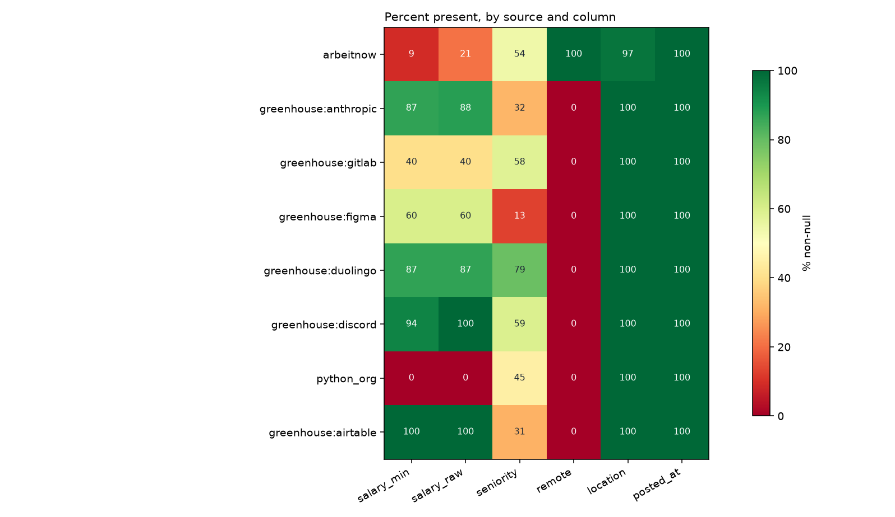
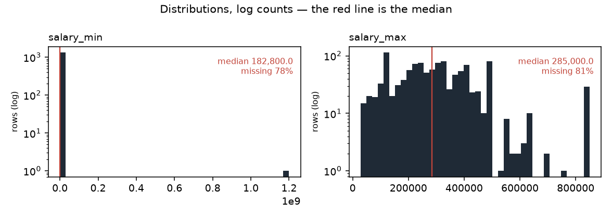

# Data profile — snapshot `2026-09-07`

| | |
|---|---|
| Generated by | `python -m src.data.profile` |
| Data | **real** · snapshot `2026-09-07` · `data/raw/2026-09-07/manifest.json` |
| Panel | 6,107 rows · sha256 `a204e9238c92…` |
| Code | `f8e3c4dd7` on `feature/reports-from-a-clean-tree` (clean) |
| Snapshot sha256 | `faff39a41dec…` |
| Contents | 6,107 jobs · 24,962 observations · 111 runs |

_Regenerate rather than edit._

Measured facts only; the interpretation lives in `docs/data_dictionary.md`.

## Columns (`jobs`)

| column | dtype | non_null | null_pct | n_unique |
|---|---|---|---|---|
| id | int64 | 6,107 | 0.0 | 6,107 |
| source | string | 6,107 | 0.0 | 8 |
| source_id | string | 6,107 | 0.0 | 6,107 |
| title | string | 6,107 | 0.0 | 4,743 |
| company | string | 6,107 | 0.0 | 1,722 |
| location | string | 5,947 | 2.6 | 936 |
| remote | boolean | 4,845 | 20.7 | 2 |
| salary_min | Int64 | 1,336 | 78.1 | 252 |
| salary_max | Int64 | 1,150 | 81.2 | 230 |
| currency | string | 1,940 | 68.2 | 3 |
| salary_raw | string | 1,940 | 68.2 | 707 |
| posted_at | datetime64[us, UTC] | 6,107 | 0.0 | 242 |
| url | string | 6,107 | 0.0 | 6,107 |
| description | string | 6,074 | 0.5 | 5,507 |
| first_seen | datetime64[us, UTC] | 6,107 | 0.0 | 44 |
| last_seen | datetime64[us, UTC] | 6,107 | 0.0 | 42 |
| content_hash | string | 6,107 | 0.0 | 6,090 |
| hash_version | Int64 | 6,107 | 0.0 | 1 |
| seniority | string | 3,134 | 48.7 | 8 |
| parser_version | Int64 | 3,430 | 43.8 | 1 |
| remote_inferred | float64 | 691 | 88.7 | 1 |

## Coverage by source (% non-null)

Missing is not random here: the blocks of red are whole sources that never
populate a field, so "this column is null" is largely a restatement of which
board the row came from.

_Figures regenerate with the report; `.` is written beside it._

Read this as the missingness fingerprint: where a column is 0 or 100 for a
whole source, 'missing' is a synonym for 'came from that source'.

| source | jobs | salary_min | salary_raw | seniority | remote | location | posted_at |
|---|---|---|---|---|---|---|---|
| arbeitnow | 4,845 | 9 | 21 | 54 | 100 | 97 | 100 |
| greenhouse:anthropic | 645 | 87 | 88 | 32 | 0 | 100 | 100 |
| greenhouse:gitlab | 253 | 40 | 40 | 58 | 0 | 100 | 100 |
| greenhouse:figma | 167 | 60 | 60 | 13 | 0 | 100 | 100 |
| greenhouse:duolingo | 94 | 87 | 87 | 79 | 0 | 100 | 100 |
| greenhouse:discord | 54 | 94 | 100 | 59 | 0 | 100 | 100 |
| python_org | 33 | 0 | 0 | 45 | 0 | 100 | 100 |
| greenhouse:airtable | 16 | 100 | 100 | 31 | 0 | 100 | 100 |

## Run completeness

`capped_runs` counts runs where `pages_fetched >= page_cap` — the scraper
stopped early, so the board was only partly observed and a posting's absence
from that run is not evidence it was removed.

| source | runs | ok | partial | failed | capped_runs | first_run | last_run |
|---|---|---|---|---|---|---|---|
| python_org | 31 | 20 | 11 | 0 | 0 | 2026-08-29 | 2026-09-07 |
| arbeitnow | 26 | 9 | 16 | 1 | 8 | 2026-08-29 | 2026-09-07 |
| greenhouse:airtable | 9 | 9 | 0 | 0 | 0 | 2026-08-30 | 2026-09-07 |
| greenhouse:anthropic | 9 | 9 | 0 | 0 | 0 | 2026-08-30 | 2026-09-07 |
| greenhouse:discord | 9 | 9 | 0 | 0 | 0 | 2026-08-30 | 2026-09-07 |
| greenhouse:duolingo | 9 | 9 | 0 | 0 | 0 | 2026-08-30 | 2026-09-07 |
| greenhouse:figma | 9 | 9 | 0 | 0 | 0 | 2026-08-30 | 2026-09-07 |
| greenhouse:gitlab | 9 | 9 | 0 | 0 | 0 | 2026-08-30 | 2026-09-07 |

## Panel shape

| source | jobs | mean_days_seen | max_days_seen | seen_once | seen_once_pct |
|---|---|---|---|---|---|
| arbeitnow | 4,845 | 2.0 | 4 | 1,647 | 34.0 |
| greenhouse:anthropic | 645 | 8.1 | 9 | 1 | 0.2 |
| greenhouse:gitlab | 253 | 8.0 | 9 | 0 | 0.0 |
| greenhouse:figma | 167 | 8.6 | 9 | 0 | 0.0 |
| greenhouse:duolingo | 94 | 8.3 | 9 | 0 | 0.0 |
| greenhouse:discord | 54 | 8.2 | 9 | 0 | 0.0 |
| python_org | 33 | 8.9 | 10 | 0 | 0.0 |
| greenhouse:airtable | 16 | 9.0 | 9 | 0 | 0.0 |
