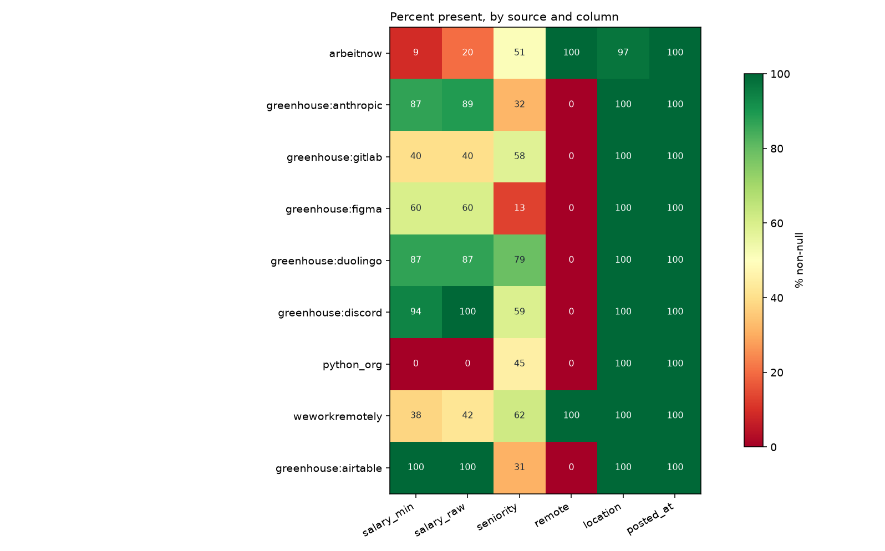
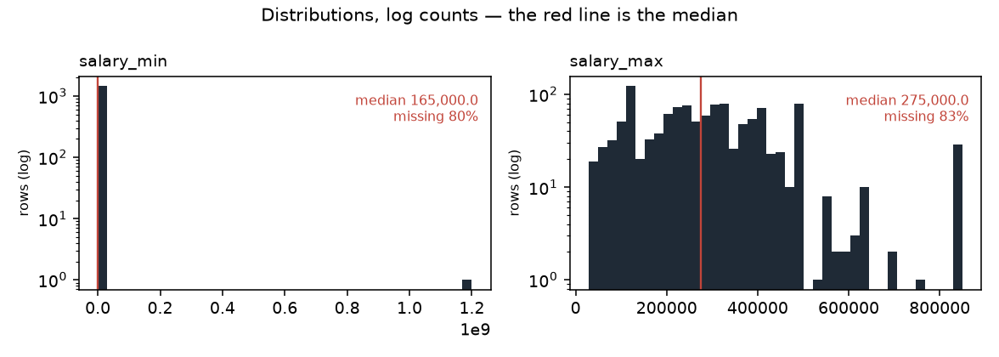

# Data profile — snapshot `2026-09-08`

Generated by `python -m src.data.profile`. Measured facts only; the
interpretation lives in `docs/data_dictionary.md`.

- snapshot sha256: `204d5aae1e789224ad5f2b1f5a70ec5469c3ec43829e4b6e6a082fd63979e82d`
- jobs: 7,312 · observations: 29,464 · runs: 122

## Columns (`jobs`)

| column | dtype | non_null | null_pct | n_unique |
|---|---|---|---|---|
| id | int64 | 7,312 | 0.0 | 7,312 |
| source | string | 7,312 | 0.0 | 9 |
| source_id | string | 7,312 | 0.0 | 7,312 |
| title | string | 7,312 | 0.0 | 5,691 |
| company | string | 7,312 | 0.0 | 2,209 |
| location | string | 7,150 | 2.2 | 1,078 |
| remote | boolean | 6,048 | 17.3 | 2 |
| salary_min | Int64 | 1,461 | 80.0 | 266 |
| salary_max | Int64 | 1,215 | 83.4 | 241 |
| currency | string | 2,158 | 70.5 | 3 |
| salary_raw | string | 2,158 | 70.5 | 788 |
| posted_at | datetime64[us, UTC] | 7,312 | 0.0 | 243 |
| url | string | 7,312 | 0.0 | 7,312 |
| description | string | 7,279 | 0.5 | 6,573 |
| first_seen | datetime64[us, UTC] | 7,312 | 0.0 | 48 |
| last_seen | datetime64[us, UTC] | 7,312 | 0.0 | 46 |
| content_hash | string | 7,312 | 0.0 | 7,288 |
| hash_version | Int64 | 7,312 | 0.0 | 1 |
| seniority | string | 3,603 | 50.7 | 8 |
| parser_version | Int64 | 5,215 | 28.7 | 1 |
| remote_inferred | float64 | 746 | 89.8 | 1 |
| job_type_raw | str | 4,276 | 41.5 | 167 |
| tags_raw | str | 5,370 | 26.6 | 1,304 |
| seniority_stated | str | 2,485 | 66.0 | 6 |

## Coverage by source (% non-null)

Missing is not random here: the blocks of red are whole sources that never
populate a field, so "this column is null" is largely a restatement of which
board the row came from.

_Figures regenerate with the report; `.` is written beside it._

Read this as the missingness fingerprint: where a column is 0 or 100 for a
whole source, 'missing' is a synonym for 'came from that source'.

| source | jobs | salary_min | salary_raw | seniority | remote | location | posted_at |
|---|---|---|---|---|---|---|---|
| arbeitnow | 6,022 | 9 | 20 | 51 | 100 | 97 | 100 |
| greenhouse:anthropic | 647 | 87 | 89 | 32 | 0 | 100 | 100 |
| greenhouse:gitlab | 253 | 40 | 40 | 58 | 0 | 100 | 100 |
| greenhouse:figma | 167 | 60 | 60 | 13 | 0 | 100 | 100 |
| greenhouse:duolingo | 94 | 87 | 87 | 79 | 0 | 100 | 100 |
| greenhouse:discord | 54 | 94 | 100 | 59 | 0 | 100 | 100 |
| python_org | 33 | 0 | 0 | 45 | 0 | 100 | 100 |
| weworkremotely | 26 | 38 | 42 | 62 | 100 | 100 | 100 |
| greenhouse:airtable | 16 | 100 | 100 | 31 | 0 | 100 | 100 |

## Run completeness

`capped_runs` counts runs where `pages_fetched >= page_cap` — the scraper
stopped early, so the board was only partly observed and a posting's absence
from that run is not evidence it was removed.

| source | runs | ok | partial | failed | capped_runs | first_run | last_run |
|---|---|---|---|---|---|---|---|
| python_org | 32 | 21 | 11 | 0 | 0 | 2026-08-29 | 2026-09-08 |
| arbeitnow | 27 | 9 | 17 | 1 | 9 | 2026-08-29 | 2026-09-08 |
| greenhouse:airtable | 10 | 10 | 0 | 0 | 0 | 2026-08-30 | 2026-09-08 |
| greenhouse:anthropic | 10 | 10 | 0 | 0 | 0 | 2026-08-30 | 2026-09-08 |
| greenhouse:discord | 10 | 10 | 0 | 0 | 0 | 2026-08-30 | 2026-09-08 |
| greenhouse:duolingo | 10 | 10 | 0 | 0 | 0 | 2026-08-30 | 2026-09-08 |
| greenhouse:figma | 10 | 10 | 0 | 0 | 0 | 2026-08-30 | 2026-09-08 |
| greenhouse:gitlab | 10 | 10 | 0 | 0 | 0 | 2026-08-30 | 2026-09-08 |
| weworkremotely | 3 | 0 | 3 | 0 | 2 | 2026-09-07 | 2026-09-08 |

## Panel shape

| source | jobs | mean_days_seen | max_days_seen | seen_once | seen_once_pct |
|---|---|---|---|---|---|
| arbeitnow | 6,022 | 2.2 | 5 | 2,257 | 37.5 |
| greenhouse:anthropic | 647 | 9.0 | 10 | 3 | 0.5 |
| greenhouse:gitlab | 253 | 8.9 | 10 | 0 | 0.0 |
| greenhouse:figma | 167 | 9.5 | 10 | 0 | 0.0 |
| greenhouse:duolingo | 94 | 9.3 | 10 | 0 | 0.0 |
| greenhouse:discord | 54 | 9.1 | 10 | 0 | 0.0 |
| python_org | 33 | 9.8 | 11 | 0 | 0.0 |
| weworkremotely | 26 | 1.9 | 2 | 2 | 7.7 |
| greenhouse:airtable | 16 | 10.0 | 10 | 0 | 0.0 |
