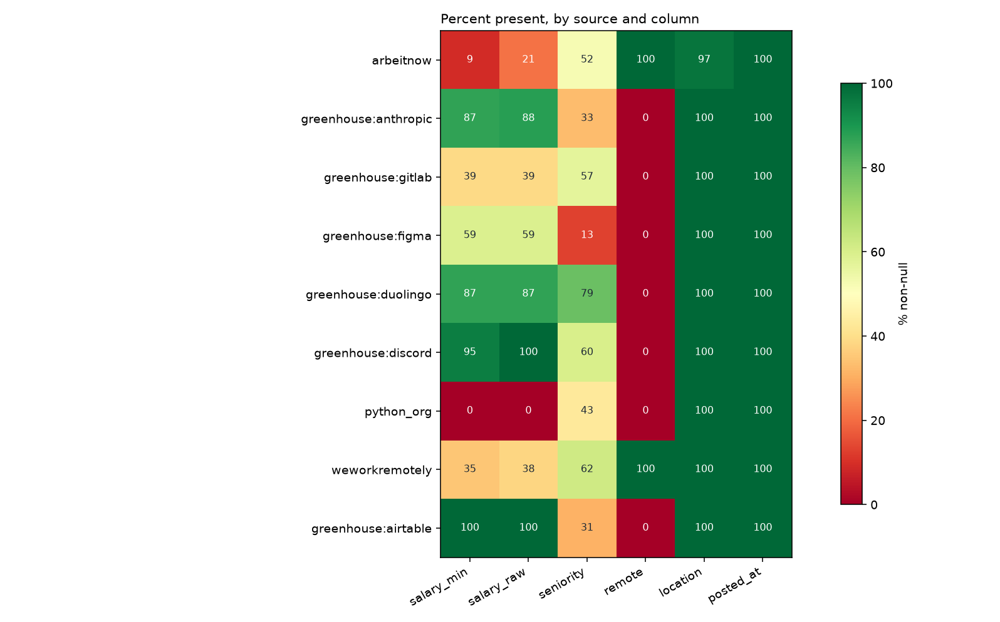
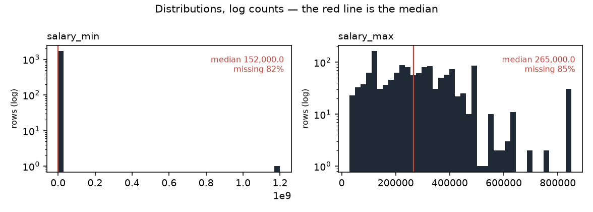

# Data profile — snapshot `2026-09-12`

| | |
|---|---|
| Generated by | `python -m src.data.profile` |
| Data | **real** · snapshot `2026-09-12` · `data/raw/2026-09-12/manifest.json` |
| Panel | 9,404 rows · sha256 `0c15dccf89c5…` |
| Code | `f8e3c4dd7` on `feature/reports-from-a-clean-tree` (clean) |
| Snapshot sha256 | `bfc77124e2d1…` |
| Contents | 9,404 jobs · 42,830 observations · 149 runs |

_Regenerate rather than edit._

Measured facts only; the interpretation lives in `docs/data_dictionary.md`.

## Columns (`jobs`)

| column | dtype | non_null | null_pct | n_unique |
|---|---|---|---|---|
| id | int64 | 9,404 | 0.0 | 9,404 |
| source | string | 9,404 | 0.0 | 9 |
| source_id | string | 9,404 | 0.0 | 9,404 |
| title | string | 9,404 | 0.0 | 6,989 |
| company | string | 9,404 | 0.0 | 2,571 |
| location | string | 9,199 | 2.2 | 1,264 |
| remote | boolean | 8,058 | 14.3 | 2 |
| salary_min | Int64 | 1,706 | 81.9 | 297 |
| salary_max | Int64 | 1,369 | 85.4 | 267 |
| currency | string | 2,666 | 71.7 | 3 |
| salary_raw | string | 2,666 | 71.7 | 911 |
| posted_at | datetime64[us, UTC] | 9,404 | 0.0 | 247 |
| url | string | 9,404 | 0.0 | 9,404 |
| description | string | 9,369 | 0.4 | 8,221 |
| first_seen | datetime64[us, UTC] | 9,404 | 0.0 | 64 |
| last_seen | datetime64[us, UTC] | 9,404 | 0.0 | 64 |
| content_hash | string | 9,404 | 0.0 | 9,382 |
| hash_version | Int64 | 9,404 | 0.0 | 2 |
| seniority | string | 4,718 | 49.8 | 8 |
| parser_version | Int64 | 7,311 | 22.3 | 1 |
| remote_inferred | float64 | 871 | 90.7 | 1 |
| job_type_raw | str | 5,644 | 40.0 | 184 |
| tags_raw | str | 7,133 | 24.1 | 1,542 |
| seniority_stated | str | 3,249 | 65.5 | 6 |

## Coverage by source (% non-null)

Missing is not random here: the blocks of red are whole sources that never
populate a field, so "this column is null" is largely a restatement of which
board the row came from.

_Figures regenerate with the report; `.` is written beside it._

Read this as the missingness fingerprint: where a column is 0 or 100 for a
whole source, 'missing' is a synonym for 'came from that source'.

| source | jobs | salary_min | salary_raw | seniority | remote | location | posted_at |
|---|---|---|---|---|---|---|---|
| arbeitnow | 8,024 | 9 | 21 | 52 | 100 | 97 | 100 |
| greenhouse:anthropic | 693 | 87 | 88 | 33 | 0 | 100 | 100 |
| greenhouse:gitlab | 276 | 39 | 39 | 57 | 0 | 100 | 100 |
| greenhouse:figma | 175 | 59 | 59 | 13 | 0 | 100 | 100 |
| greenhouse:duolingo | 94 | 87 | 87 | 79 | 0 | 100 | 100 |
| greenhouse:discord | 57 | 95 | 100 | 60 | 0 | 100 | 100 |
| python_org | 35 | 0 | 0 | 43 | 0 | 100 | 100 |
| weworkremotely | 34 | 35 | 38 | 62 | 100 | 100 | 100 |
| greenhouse:airtable | 16 | 100 | 100 | 31 | 0 | 100 | 100 |

## Run completeness

`capped_runs` counts runs where `pages_fetched >= page_cap` — the scraper
stopped early, so the board was only partly observed and a posting's absence
from that run is not evidence it was removed.

| source | runs | ok | partial | failed | capped_runs | first_run | last_run |
|---|---|---|---|---|---|---|---|
| python_org | 35 | 24 | 11 | 0 | 0 | 2026-08-29 | 2026-09-12 |
| arbeitnow | 30 | 9 | 20 | 1 | 12 | 2026-08-29 | 2026-09-12 |
| greenhouse:airtable | 13 | 13 | 0 | 0 | 0 | 2026-08-30 | 2026-09-12 |
| greenhouse:anthropic | 13 | 13 | 0 | 0 | 0 | 2026-08-30 | 2026-09-12 |
| greenhouse:discord | 13 | 13 | 0 | 0 | 0 | 2026-08-30 | 2026-09-12 |
| greenhouse:duolingo | 13 | 13 | 0 | 0 | 0 | 2026-08-30 | 2026-09-12 |
| greenhouse:figma | 13 | 13 | 0 | 0 | 0 | 2026-08-30 | 2026-09-12 |
| greenhouse:gitlab | 13 | 13 | 0 | 0 | 0 | 2026-08-30 | 2026-09-12 |
| weworkremotely | 6 | 0 | 6 | 0 | 2 | 2026-09-07 | 2026-09-12 |

## Panel shape

| source | jobs | mean_days_seen | max_days_seen | seen_once | seen_once_pct |
|---|---|---|---|---|---|
| arbeitnow | 8,024 | 2.9 | 8 | 2,046 | 25.5 |
| greenhouse:anthropic | 693 | 11.0 | 13 | 15 | 2.2 |
| greenhouse:gitlab | 276 | 10.7 | 13 | 5 | 1.8 |
| greenhouse:figma | 175 | 11.8 | 13 | 0 | 0.0 |
| greenhouse:duolingo | 94 | 11.9 | 13 | 0 | 0.0 |
| greenhouse:discord | 57 | 11.0 | 13 | 2 | 3.5 |
| python_org | 35 | 11.8 | 14 | 0 | 0.0 |
| weworkremotely | 34 | 3.7 | 5 | 5 | 14.7 |
| greenhouse:airtable | 16 | 13.0 | 13 | 0 | 0.0 |
