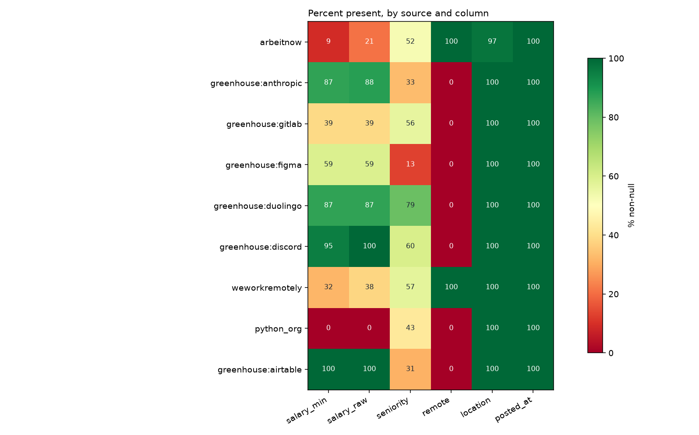
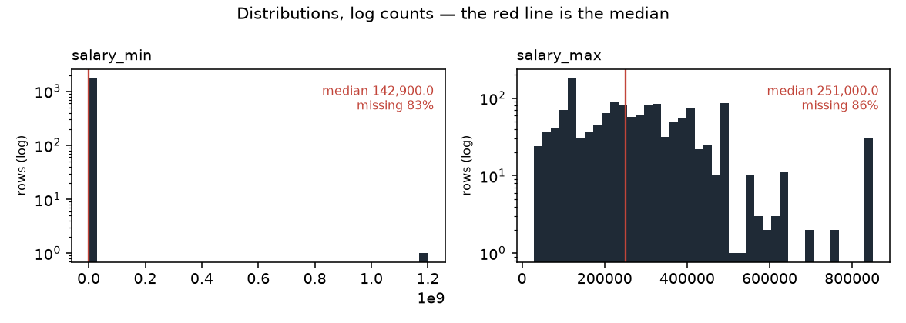

# Data profile — snapshot `2026-09-14`

| | |
|---|---|
| Generated by | `python -m src.data.profile` |
| Data | **real** · snapshot `2026-09-14` · `data/raw/2026-09-14/manifest.json` |
| Panel | 10,249 rows · sha256 `1585025eb20b…` |
| Code | `592fb1ea7` on `chore/reports-2026-09-14` (clean) |
| Snapshot sha256 | `5bbf705ae468…` |
| Contents | 10,249 jobs · 51,747 observations · 167 runs |

_Regenerate rather than edit._

Measured facts only; the interpretation lives in `docs/data_dictionary.md`.

## Columns (`jobs`)

| column | dtype | non_null | null_pct | n_unique |
|---|---|---|---|---|
| id | int64 | 10,249 | 0.0 | 10,249 |
| source | string | 10,249 | 0.0 | 9 |
| source_id | string | 10,249 | 0.0 | 10,249 |
| title | string | 10,249 | 0.0 | 7,505 |
| company | string | 10,249 | 0.0 | 2,677 |
| location | string | 9,970 | 2.7 | 1,382 |
| remote | boolean | 8,900 | 13.2 | 2 |
| salary_min | Int64 | 1,776 | 82.7 | 304 |
| salary_max | Int64 | 1,412 | 86.2 | 275 |
| currency | string | 2,873 | 72.0 | 3 |
| salary_raw | string | 2,873 | 72.0 | 945 |
| posted_at | datetime64[us, UTC] | 10,249 | 0.0 | 249 |
| url | string | 10,249 | 0.0 | 10,249 |
| description | string | 10,214 | 0.3 | 8,829 |
| first_seen | datetime64[us, UTC] | 10,249 | 0.0 | 70 |
| last_seen | datetime64[us, UTC] | 10,249 | 0.0 | 68 |
| content_hash | string | 10,249 | 0.0 | 10,225 |
| hash_version | Int64 | 10,249 | 0.0 | 2 |
| seniority | string | 5,166 | 49.6 | 8 |
| parser_version | Int64 | 8,156 | 20.4 | 1 |
| remote_inferred | float64 | 950 | 90.7 | 1 |
| job_type_raw | str | 6,228 | 39.2 | 191 |
| tags_raw | str | 7,859 | 23.3 | 1,701 |
| seniority_stated | str | 3,514 | 65.7 | 6 |
| adapter_version | float64 | 4,444 | 56.6 | 1 |
| company_id | int64 | 10,249 | 0.0 | 2,643 |
| location_id | float64 | 9,970 | 2.7 | 1,382 |

## Coverage by source (% non-null)

Missing is not random here: the blocks of red are whole sources that never
populate a field, so "this column is null" is largely a restatement of which
board the row came from.

_Figures regenerate with the report; `.` is written beside it._

Read this as the missingness fingerprint: where a column is 0 or 100 for a
whole source, 'missing' is a synonym for 'came from that source'.

| source | jobs | salary_min | salary_raw | seniority | remote | location | posted_at |
|---|---|---|---|---|---|---|---|
| arbeitnow | 8,863 | 9 | 21 | 52 | 100 | 97 | 100 |
| greenhouse:anthropic | 694 | 87 | 88 | 33 | 0 | 100 | 100 |
| greenhouse:gitlab | 278 | 39 | 39 | 56 | 0 | 100 | 100 |
| greenhouse:figma | 175 | 59 | 59 | 13 | 0 | 100 | 100 |
| greenhouse:duolingo | 94 | 87 | 87 | 79 | 0 | 100 | 100 |
| greenhouse:discord | 57 | 95 | 100 | 60 | 0 | 100 | 100 |
| weworkremotely | 37 | 32 | 38 | 57 | 100 | 100 | 100 |
| python_org | 35 | 0 | 0 | 43 | 0 | 100 | 100 |
| greenhouse:airtable | 16 | 100 | 100 | 31 | 0 | 100 | 100 |

## Run completeness

`capped_runs` counts runs where `pages_fetched >= page_cap` — the scraper
stopped early, so the board was only partly observed and a posting's absence
from that run is not evidence it was removed.

| source | runs | ok | partial | failed | capped_runs | first_run | last_run |
|---|---|---|---|---|---|---|---|
| python_org | 37 | 26 | 11 | 0 | 0 | 2026-08-29 | 2026-09-14 |
| arbeitnow | 32 | 9 | 22 | 1 | 14 | 2026-08-29 | 2026-09-14 |
| greenhouse:airtable | 15 | 15 | 0 | 0 | 0 | 2026-08-30 | 2026-09-14 |
| greenhouse:anthropic | 15 | 15 | 0 | 0 | 0 | 2026-08-30 | 2026-09-14 |
| greenhouse:discord | 15 | 15 | 0 | 0 | 0 | 2026-08-30 | 2026-09-14 |
| greenhouse:duolingo | 15 | 15 | 0 | 0 | 0 | 2026-08-30 | 2026-09-14 |
| greenhouse:figma | 15 | 15 | 0 | 0 | 0 | 2026-08-30 | 2026-09-14 |
| greenhouse:gitlab | 15 | 15 | 0 | 0 | 0 | 2026-08-30 | 2026-09-14 |
| weworkremotely | 8 | 0 | 8 | 0 | 2 | 2026-09-07 | 2026-09-14 |

## Panel shape

| source | jobs | mean_days_seen | max_days_seen | seen_once | seen_once_pct |
|---|---|---|---|---|---|
| arbeitnow | 8,863 | 3.3 | 10 | 2,028 | 22.9 |
| greenhouse:anthropic | 694 | 12.7 | 15 | 1 | 0.1 |
| greenhouse:gitlab | 278 | 12.2 | 15 | 1 | 0.4 |
| greenhouse:figma | 175 | 13.5 | 15 | 0 | 0.0 |
| greenhouse:duolingo | 94 | 13.7 | 15 | 0 | 0.0 |
| greenhouse:discord | 57 | 12.6 | 15 | 0 | 0.0 |
| weworkremotely | 37 | 4.7 | 7 | 4 | 10.8 |
| python_org | 35 | 13.5 | 16 | 0 | 0.0 |
| greenhouse:airtable | 16 | 15.0 | 15 | 0 | 0.0 |
