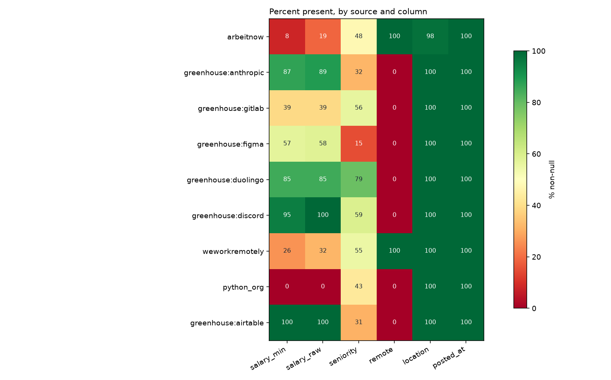
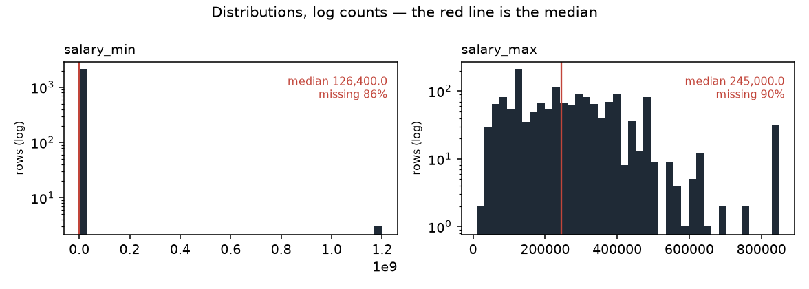

# Data profile — snapshot `2026-09-17`

| | |
|---|---|
| Generated by | `python -m src.data.profile` |
| Data | **real** · snapshot `2026-09-17` · `data/raw/2026-09-17/manifest.json` |
| Panel | 14,741 rows · sha256 `82d77fa90793…` |
| Code | `5e4e7a768` on `phase-7` (clean) |
| Snapshot sha256 | `26c307ddd2c1…` |
| Contents | 14,741 jobs · 65,014 observations · 194 runs |

_Regenerate rather than edit._

Measured facts only; the interpretation lives in `docs/data_dictionary.md`.

## Columns (`jobs`)

| column | dtype | non_null | null_pct | n_unique |
|---|---|---|---|---|
| id | int64 | 14,741 | 0.0 | 14,741 |
| source | string | 14,741 | 0.0 | 9 |
| source_id | string | 14,741 | 0.0 | 14,741 |
| title | string | 14,741 | 0.0 | 11,100 |
| company | string | 14,741 | 0.0 | 4,505 |
| location | string | 14,419 | 2.2 | 1,819 |
| remote | boolean | 13,343 | 9.5 | 2 |
| salary_min | Int64 | 2,080 | 85.9 | 333 |
| salary_max | Int64 | 1,541 | 89.5 | 292 |
| currency | string | 3,530 | 76.1 | 3 |
| salary_raw | string | 3,530 | 76.1 | 1,159 |
| posted_at | datetime64[us, UTC] | 14,741 | 0.0 | 252 |
| url | string | 14,741 | 0.0 | 14,741 |
| description | string | 14,706 | 0.2 | 12,933 |
| first_seen | datetime64[us, UTC] | 14,741 | 0.0 | 87 |
| last_seen | datetime64[us, UTC] | 14,741 | 0.0 | 86 |
| content_hash | string | 14,741 | 0.0 | 14,716 |
| hash_version | Int64 | 14,741 | 0.0 | 2 |
| seniority | string | 6,926 | 53.0 | 8 |
| parser_version | Int64 | 12,649 | 14.2 | 1 |
| remote_inferred | float64 | 1,070 | 92.7 | 1 |
| job_type_raw | str | 9,061 | 38.5 | 219 |
| tags_raw | str | 12,126 | 17.7 | 1,906 |
| seniority_stated | str | 5,398 | 63.4 | 6 |
| adapter_version | float64 | 8,940 | 39.4 | 1 |
| company_id | int64 | 14,741 | 0.0 | 4,456 |
| location_id | float64 | 14,419 | 2.2 | 1,819 |

## Coverage by source (% non-null)

Missing is not random here: the blocks of red are whole sources that never
populate a field, so "this column is null" is largely a restatement of which
board the row came from.

_Figures regenerate with the report; `.` is written beside it._

Read this as the missingness fingerprint: where a column is 0 or 100 for a
whole source, 'missing' is a synonym for 'came from that source'.

| source | jobs | salary_min | salary_raw | seniority | remote | location | posted_at |
|---|---|---|---|---|---|---|---|
| arbeitnow | 13,296 | 8 | 19 | 48 | 100 | 98 | 100 |
| greenhouse:anthropic | 713 | 87 | 89 | 32 | 0 | 100 | 100 |
| greenhouse:gitlab | 291 | 39 | 39 | 56 | 0 | 100 | 100 |
| greenhouse:figma | 185 | 57 | 58 | 15 | 0 | 100 | 100 |
| greenhouse:duolingo | 97 | 85 | 85 | 79 | 0 | 100 | 100 |
| greenhouse:discord | 61 | 95 | 100 | 59 | 0 | 100 | 100 |
| weworkremotely | 47 | 26 | 32 | 55 | 100 | 100 | 100 |
| python_org | 35 | 0 | 0 | 43 | 0 | 100 | 100 |
| greenhouse:airtable | 16 | 100 | 100 | 31 | 0 | 100 | 100 |

## Run completeness

`capped_runs` counts runs where `pages_fetched >= page_cap` — the scraper
stopped early, so the board was only partly observed and a posting's absence
from that run is not evidence it was removed.

| source | runs | ok | partial | failed | capped_runs | first_run | last_run |
|---|---|---|---|---|---|---|---|
| python_org | 40 | 29 | 11 | 0 | 0 | 2026-08-29 | 2026-09-17 |
| arbeitnow | 35 | 9 | 25 | 1 | 17 | 2026-08-29 | 2026-09-17 |
| greenhouse:airtable | 18 | 18 | 0 | 0 | 0 | 2026-08-30 | 2026-09-17 |
| greenhouse:anthropic | 18 | 18 | 0 | 0 | 0 | 2026-08-30 | 2026-09-17 |
| greenhouse:discord | 18 | 18 | 0 | 0 | 0 | 2026-08-30 | 2026-09-17 |
| greenhouse:duolingo | 18 | 18 | 0 | 0 | 0 | 2026-08-30 | 2026-09-17 |
| greenhouse:figma | 18 | 18 | 0 | 0 | 0 | 2026-08-30 | 2026-09-17 |
| greenhouse:gitlab | 18 | 18 | 0 | 0 | 0 | 2026-08-30 | 2026-09-17 |
| weworkremotely | 11 | 0 | 11 | 0 | 2 | 2026-09-07 | 2026-09-17 |

## Panel shape

| source | jobs | mean_days_seen | max_days_seen | seen_once | seen_once_pct |
|---|---|---|---|---|---|
| arbeitnow | 13,296 | 3.0 | 10 | 3,299 | 24.8 |
| greenhouse:anthropic | 713 | 14.9 | 18 | 10 | 1.4 |
| greenhouse:gitlab | 291 | 14.0 | 18 | 3 | 1.0 |
| greenhouse:figma | 185 | 15.3 | 18 | 2 | 1.1 |
| greenhouse:duolingo | 97 | 15.8 | 18 | 0 | 0.0 |
| greenhouse:discord | 61 | 14.1 | 18 | 0 | 0.0 |
| weworkremotely | 47 | 5.3 | 10 | 6 | 12.8 |
| python_org | 35 | 15.9 | 19 | 0 | 0.0 |
| greenhouse:airtable | 16 | 18.0 | 18 | 0 | 0.0 |
