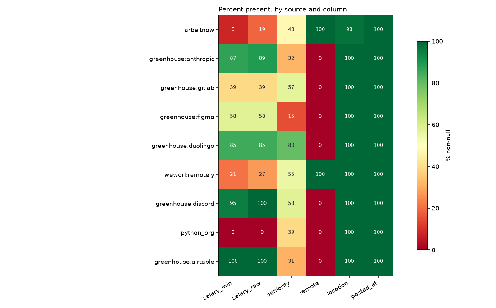
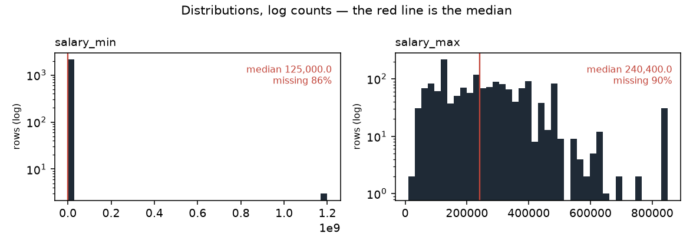

# Data profile — snapshot `2026-09-18`

| | |
|---|---|
| Generated by | `python -m src.data.profile` |
| Data | **real** · snapshot `2026-09-18` · `data/raw/2026-09-18/manifest.json` |
| Panel | 15,379 rows · sha256 `f9d8fedf9776…` |
| Code | `36bdd499a` on `phase-7-readiness-safety` (clean) |
| Snapshot sha256 | `2373bf422b22…` |
| Contents | 15,379 jobs · 69,465 observations · 203 runs |

_Regenerate rather than edit._

Measured facts only; the interpretation lives in `docs/data_dictionary.md`.

## Columns (`jobs`)

| column | dtype | non_null | null_pct | n_unique |
|---|---|---|---|---|
| id | int64 | 15,379 | 0.0 | 15,379 |
| source | string | 15,379 | 0.0 | 9 |
| source_id | string | 15,379 | 0.0 | 15,379 |
| title | string | 15,379 | 0.0 | 11,478 |
| company | string | 15,379 | 0.0 | 4,615 |
| location | string | 15,036 | 2.2 | 1,847 |
| remote | boolean | 13,961 | 9.2 | 2 |
| salary_min | Int64 | 2,141 | 86.1 | 344 |
| salary_max | Int64 | 1,589 | 89.7 | 302 |
| currency | string | 3,657 | 76.2 | 3 |
| salary_raw | string | 3,657 | 76.2 | 1,190 |
| posted_at | datetime64[us, UTC] | 15,379 | 0.0 | 253 |
| url | string | 15,379 | 0.0 | 15,379 |
| description | string | 15,341 | 0.2 | 13,458 |
| first_seen | datetime64[us, UTC] | 15,379 | 0.0 | 95 |
| last_seen | datetime64[us, UTC] | 15,379 | 0.0 | 93 |
| content_hash | string | 15,379 | 0.0 | 15,350 |
| hash_version | Int64 | 15,379 | 0.0 | 2 |
| seniority | string | 7,257 | 52.8 | 8 |
| parser_version | Int64 | 13,287 | 13.6 | 1 |
| remote_inferred | float64 | 1,150 | 92.5 | 1 |
| job_type_raw | str | 9,465 | 38.5 | 224 |
| tags_raw | str | 12,660 | 17.7 | 1,984 |
| seniority_stated | str | 5,607 | 63.5 | 6 |
| adapter_version | float64 | 9,578 | 37.7 | 1 |
| company_id | int64 | 15,379 | 0.0 | 4,565 |
| location_id | float64 | 15,036 | 2.2 | 1,847 |

## Coverage by source (% non-null)

Missing is not random here: the blocks of red are whole sources that never
populate a field, so "this column is null" is largely a restatement of which
board the row came from.

_Figures regenerate with the report; `.` is written beside it._

Read this as the missingness fingerprint: where a column is 0 or 100 for a
whole source, 'missing' is a synonym for 'came from that source'.

| source | jobs | salary_min | salary_raw | seniority | remote | location | posted_at |
|---|---|---|---|---|---|---|---|
| arbeitnow | 13,890 | 8 | 19 | 48 | 100 | 98 | 100 |
| greenhouse:anthropic | 723 | 87 | 89 | 32 | 0 | 100 | 100 |
| greenhouse:gitlab | 295 | 39 | 39 | 57 | 0 | 100 | 100 |
| greenhouse:figma | 186 | 58 | 58 | 15 | 0 | 100 | 100 |
| greenhouse:duolingo | 98 | 85 | 85 | 80 | 0 | 100 | 100 |
| weworkremotely | 71 | 21 | 27 | 55 | 100 | 100 | 100 |
| greenhouse:discord | 62 | 95 | 100 | 58 | 0 | 100 | 100 |
| python_org | 38 | 0 | 0 | 39 | 0 | 100 | 100 |
| greenhouse:airtable | 16 | 100 | 100 | 31 | 0 | 100 | 100 |

## Run completeness

`capped_runs` counts runs where `pages_fetched >= page_cap` — the scraper
stopped early, so the board was only partly observed and a posting's absence
from that run is not evidence it was removed.

| source | runs | ok | partial | failed | capped_runs | first_run | last_run |
|---|---|---|---|---|---|---|---|
| python_org | 41 | 30 | 11 | 0 | 0 | 2026-08-29 | 2026-09-18 |
| arbeitnow | 36 | 9 | 26 | 1 | 18 | 2026-08-29 | 2026-09-18 |
| greenhouse:airtable | 19 | 19 | 0 | 0 | 0 | 2026-08-30 | 2026-09-18 |
| greenhouse:anthropic | 19 | 19 | 0 | 0 | 0 | 2026-08-30 | 2026-09-18 |
| greenhouse:discord | 19 | 19 | 0 | 0 | 0 | 2026-08-30 | 2026-09-18 |
| greenhouse:duolingo | 19 | 19 | 0 | 0 | 0 | 2026-08-30 | 2026-09-18 |
| greenhouse:figma | 19 | 19 | 0 | 0 | 0 | 2026-08-30 | 2026-09-18 |
| greenhouse:gitlab | 19 | 19 | 0 | 0 | 0 | 2026-08-30 | 2026-09-18 |
| weworkremotely | 12 | 0 | 12 | 0 | 2 | 2026-09-07 | 2026-09-18 |

## Panel shape

| source | jobs | mean_days_seen | max_days_seen | seen_once | seen_once_pct |
|---|---|---|---|---|---|
| arbeitnow | 13,890 | 3.1 | 10 | 3,398 | 24.5 |
| greenhouse:anthropic | 723 | 15.5 | 19 | 11 | 1.5 |
| greenhouse:gitlab | 295 | 14.5 | 19 | 4 | 1.4 |
| greenhouse:figma | 186 | 16.1 | 19 | 1 | 0.5 |
| greenhouse:duolingo | 98 | 16.4 | 19 | 1 | 1.0 |
| weworkremotely | 71 | 3.9 | 10 | 30 | 42.3 |
| greenhouse:discord | 62 | 14.6 | 19 | 1 | 1.6 |
| python_org | 38 | 15.4 | 20 | 3 | 7.9 |
| greenhouse:airtable | 16 | 19.0 | 19 | 0 | 0.0 |
