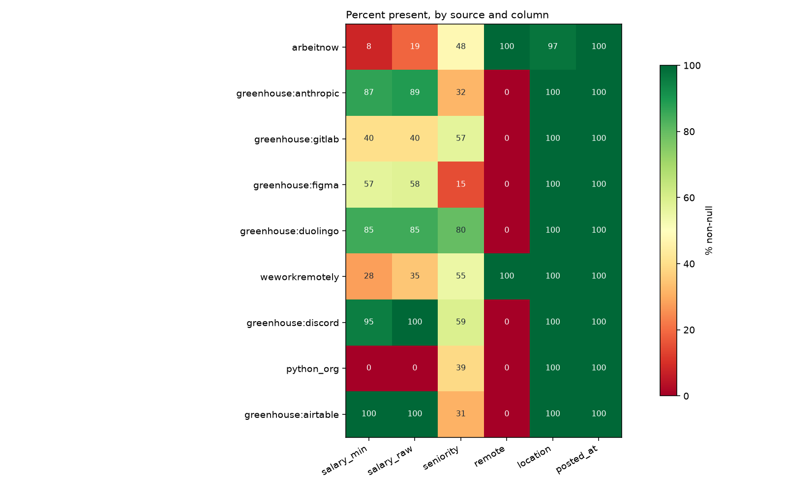
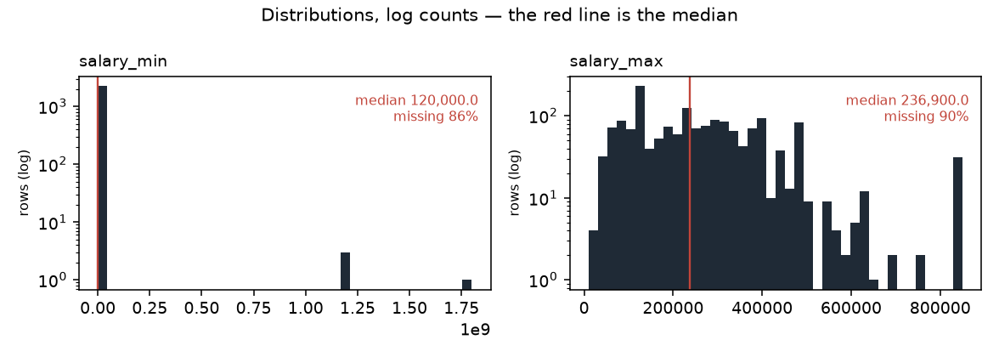

# Data profile — snapshot `2026-09-19`

| | |
|---|---|
| Generated by | `python -m src.data.profile` |
| Data | **real** · snapshot `2026-09-19` · `data/raw/2026-09-19/manifest.json` |
| Panel | 16,449 rows · sha256 `0b56adc2c01d…` |
| Code | `55652f321` on `fix/h1-rehearsal-keeps-its-own-ladder-reports` (clean) |
| Snapshot sha256 | `dd905e3e1b95…` |
| Contents | 16,449 jobs · 73,935 observations · 212 runs |

_Regenerate rather than edit._

Measured facts only; the interpretation lives in `docs/data_dictionary.md`.

## Columns (`jobs`)

| column | dtype | non_null | null_pct | n_unique |
|---|---|---|---|---|
| id | int64 | 16,449 | 0.0 | 16,449 |
| source | string | 16,449 | 0.0 | 9 |
| source_id | string | 16,449 | 0.0 | 16,449 |
| title | string | 16,449 | 0.0 | 12,230 |
| company | string | 16,449 | 0.0 | 4,750 |
| location | string | 16,068 | 2.3 | 1,927 |
| remote | boolean | 15,017 | 8.7 | 2 |
| salary_min | Int64 | 2,249 | 86.3 | 363 |
| salary_max | Int64 | 1,653 | 90.0 | 314 |
| currency | string | 3,911 | 76.2 | 3 |
| salary_raw | string | 3,911 | 76.2 | 1,263 |
| posted_at | datetime64[us, UTC] | 16,449 | 0.0 | 256 |
| url | string | 16,449 | 0.0 | 16,449 |
| description | string | 16,411 | 0.2 | 14,364 |
| first_seen | datetime64[us, UTC] | 16,449 | 0.0 | 101 |
| last_seen | datetime64[us, UTC] | 16,449 | 0.0 | 99 |
| content_hash | string | 16,449 | 0.0 | 16,422 |
| hash_version | Int64 | 16,449 | 0.0 | 2 |
| seniority | string | 7,738 | 53.0 | 8 |
| parser_version | Int64 | 14,357 | 12.7 | 1 |
| remote_inferred | float64 | 1,231 | 92.5 | 1 |
| job_type_raw | str | 10,155 | 38.3 | 248 |
| tags_raw | str | 13,607 | 17.3 | 2,202 |
| seniority_stated | str | 5,999 | 63.5 | 6 |
| adapter_version | float64 | 10,650 | 35.3 | 1 |
| company_id | int64 | 16,449 | 0.0 | 4,694 |
| location_id | float64 | 16,068 | 2.3 | 1,927 |

## Coverage by source (% non-null)

Missing is not random here: the blocks of red are whole sources that never
populate a field, so "this column is null" is largely a restatement of which
board the row came from.

_Figures regenerate with the report; `.` is written beside it._

Read this as the missingness fingerprint: where a column is 0 or 100 for a
whole source, 'missing' is a synonym for 'came from that source'.

| source | jobs | salary_min | salary_raw | seniority | remote | location | posted_at |
|---|---|---|---|---|---|---|---|
| arbeitnow | 14,921 | 8 | 19 | 48 | 100 | 97 | 100 |
| greenhouse:anthropic | 731 | 87 | 89 | 32 | 0 | 100 | 100 |
| greenhouse:gitlab | 299 | 40 | 40 | 57 | 0 | 100 | 100 |
| greenhouse:figma | 187 | 57 | 58 | 15 | 0 | 100 | 100 |
| greenhouse:duolingo | 98 | 85 | 85 | 80 | 0 | 100 | 100 |
| weworkremotely | 96 | 28 | 35 | 55 | 100 | 100 | 100 |
| greenhouse:discord | 63 | 95 | 100 | 59 | 0 | 100 | 100 |
| python_org | 38 | 0 | 0 | 39 | 0 | 100 | 100 |
| greenhouse:airtable | 16 | 100 | 100 | 31 | 0 | 100 | 100 |

## Run completeness

`capped_runs` counts runs where `pages_fetched >= page_cap` — the scraper
stopped early, so the board was only partly observed and a posting's absence
from that run is not evidence it was removed.

| source | runs | ok | partial | failed | capped_runs | first_run | last_run |
|---|---|---|---|---|---|---|---|
| python_org | 42 | 31 | 11 | 0 | 0 | 2026-08-29 | 2026-09-19 |
| arbeitnow | 37 | 9 | 27 | 1 | 19 | 2026-08-29 | 2026-09-19 |
| greenhouse:airtable | 20 | 20 | 0 | 0 | 0 | 2026-08-30 | 2026-09-19 |
| greenhouse:anthropic | 20 | 20 | 0 | 0 | 0 | 2026-08-30 | 2026-09-19 |
| greenhouse:discord | 20 | 20 | 0 | 0 | 0 | 2026-08-30 | 2026-09-19 |
| greenhouse:duolingo | 20 | 20 | 0 | 0 | 0 | 2026-08-30 | 2026-09-19 |
| greenhouse:figma | 20 | 20 | 0 | 0 | 0 | 2026-08-30 | 2026-09-19 |
| greenhouse:gitlab | 20 | 20 | 0 | 0 | 0 | 2026-08-30 | 2026-09-19 |
| weworkremotely | 13 | 0 | 13 | 0 | 2 | 2026-09-07 | 2026-09-19 |

## Panel shape

| source | jobs | mean_days_seen | max_days_seen | seen_once | seen_once_pct |
|---|---|---|---|---|---|
| arbeitnow | 14,921 | 3.1 | 10 | 4,051 | 27.1 |
| greenhouse:anthropic | 731 | 16.2 | 20 | 10 | 1.4 |
| greenhouse:gitlab | 299 | 15.1 | 20 | 6 | 2.0 |
| greenhouse:figma | 187 | 16.8 | 20 | 1 | 0.5 |
| greenhouse:duolingo | 98 | 17.3 | 20 | 0 | 0.0 |
| weworkremotely | 96 | 3.1 | 10 | 55 | 57.3 |
| greenhouse:discord | 63 | 15.1 | 20 | 1 | 1.6 |
| python_org | 38 | 16.3 | 21 | 0 | 0.0 |
| greenhouse:airtable | 16 | 20.0 | 20 | 0 | 0.0 |
