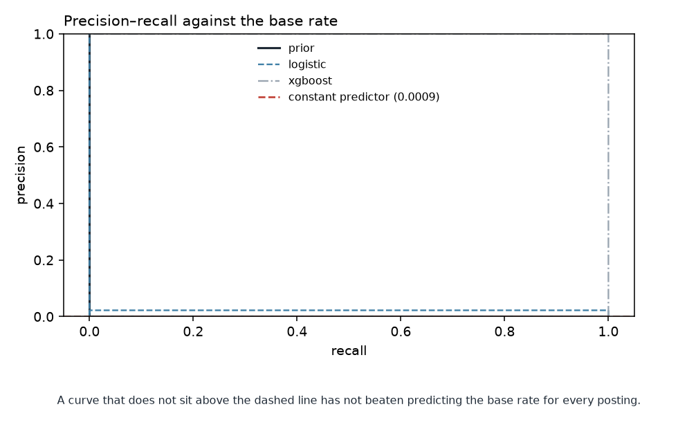
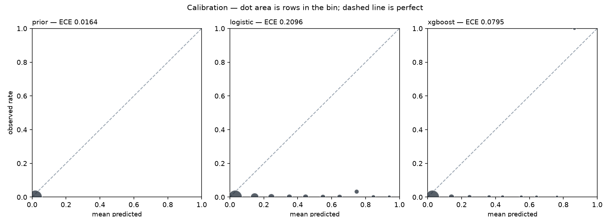

# Model comparison, threshold and calibration

| | |
|---|---|
| Generated by | `python -m src.models.evaluate` |
| Horizon | H=1 (calendar basis) — a pipeline smoke test, not the build's horizon |
| Data | **real** · snapshot `2026-09-08` · `data/processed/features/job_days_h1_calendar.parquet` |
| Panel | 10,355 rows · sha256 `fea0c88e2947…` |
| Code | `62b04c6ed` on `main` (dirty tree) |

_Regenerate rather than edit._

## What is being compared, and on what

**PR-AUC is the headline.** Accuracy is not reported: at a base rate of 0.0580, predicting "stays open" for every posting scores 94.2% and has told you nothing.

**ROC-AUC is reported but not decisive.** With rare positives it flatters. The
false-positive rate divides by the true-negative count — 8,661 of them against 533
positives — so a model can raise a great many false alarms without moving the
x-axis. Precision divides the same false alarms by the number of rows flagged,
where they cannot hide.

**Selection is on validation only.** The test block is not read by this module,
or anywhere in `src/` outside the property that defines it. A test set looked at
twice is a validation set.

**The rule below was fixed before any fold could be scored** — pre-registered in
`docs/design.md` §14 on 2026-09-10, when every `folds_scored` in this table was
zero at both horizons. A rule written after the scores are visible is not a rule,
it is a description of the winner. It runs in four steps:

1. a candidate needs 3 scored folds, or nothing is selected;
2. rank by `cv_pr_auc_mean`, and everything whose *paired* difference from the
   leader is no bigger than that difference's own spread is tied with it;
3. among the leader and everything tied with it, the **simplest** wins — only a
   lead that survives fold variance buys complexity;
4. and if that pick is a fitted model that cannot separate from the best rule a
   person could follow unaided, the rule is selected instead.

## Models, with fold variance

`cv_pr_auc_mean ± sd` across rolling-origin folds inside the training window;
`val_pr_auc` is the single draw at the real cut. Select on the first, and read
a disagreement between them as a warning rather than an average.

| model | folds_scored | cv_pr_auc_mean | cv_pr_auc_sd | val_pr_auc | val_brier | val_ece | val_roc_auc |
|---|---|---|---|---|---|---|---|
| prior | 0 | — | — | 0.0815 | 0.079 | 0.0637 | 0.5 |
| rule_older_than_30d | 0 | — | — | 0.1379 | 0.0787 | 0.0636 | 0.7019 |
| rule_posted_this_week | 0 | — | — | 0.0663 | 0.08 | 0.0636 | 0.1479 |
| age_ceiling | 0 | — | — | 0.0708 | 0.0801 | 0.0636 | 0.2157 |
| age_only | 0 | — | — | 0.7772 | 0.2447 | 0.4142 | 0.847 |
| board_hazard | 0 | — | — | 0.0901 | 0.0788 | 0.0639 | 0.5472 |
| logistic | 0 | — | — | 0.1023 | 0.1716 | 0.1925 | 0.5418 |
| decision_tree | 0 | — | — | 0.0993 | 0.1857 | 0.2611 | 0.5785 |
| random_forest | 0 | — | — | 0.114 | 0.0795 | 0.0359 | 0.5885 |
| xgboost | 0 | — | — | 0.0778 | 0.0832 | 0.0766 | 0.4024 |

## The verdict

**Chosen: None** — no model was scored on any fold

## Diagnostics

Drawn for a fixed spread of the ladder — the constant, the linear fit and the
boosted rung — chosen by **position on the ladder, never by score**. Picking the
three best-scoring candidates would be selection on the validation block wearing
a picture.

The dashed line on the first is what a constant predictor scores. A curve below
it has not beaten predicting the base rate for every posting.

## No threshold, calibration or breakdown yet

Every section below this point describes *one* model, and no model has been
selected: with no rolling-origin fold available inside the training window,
there is no evidence to select on. The `cv_pr_auc_mean` column above is empty
for exactly that reason.

Picking one anyway — the best validation score, say, or the top of the ladder —
would be selection on the validation block, which is the thing the block exists
to prevent. So the threshold sweep, the calibration curve, the per-source table
and the leave-one-board-out transfer measurement all wait for fold depth. They
are exercised meanwhile against the synthetic panel in `tests/`.

