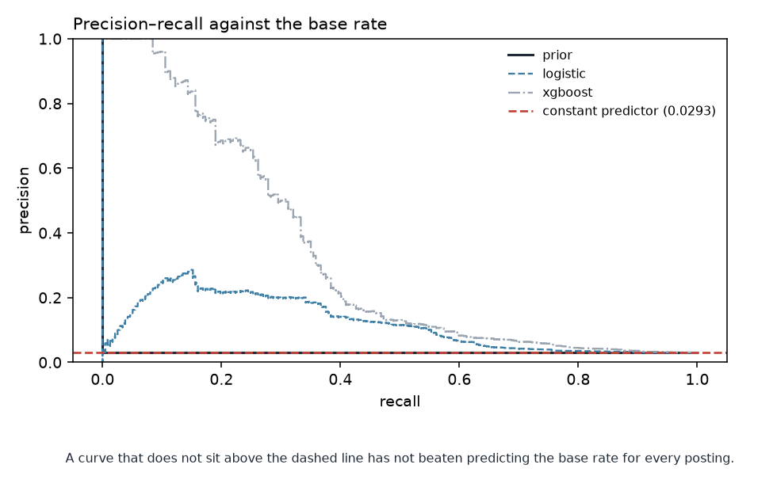
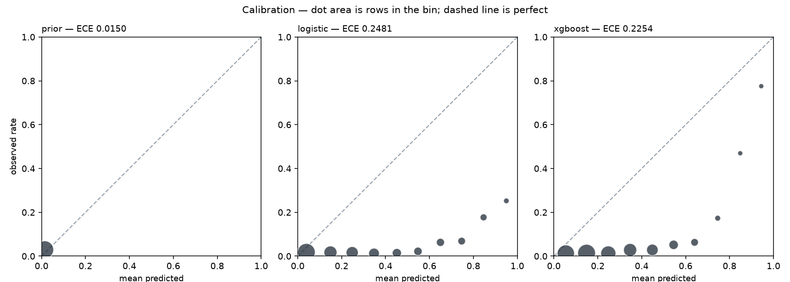

# Model comparison, threshold and calibration

| | |
|---|---|
| Generated by | `python -m src.models.evaluate` |
| Horizon | H=1 (calendar basis) — a pipeline smoke test, not the build's horizon |
| Data | **real** · snapshot `2026-10-14` · `data/processed/features/job_days_h1_calendar.parquet` |
| Panel | 54,195 rows · sha256 `42c311e4b9a8…` |
| Code | `b640656b8` on `main` (clean) |

_Regenerate rather than edit._

## What is being compared, and on what

**PR-AUC is the headline.** Accuracy is not reported: at a base rate of 0.0237, predicting "stays open" for every posting scores 97.6% and has told you nothing.

**ROC-AUC is reported but not decisive.** With rare positives it flatters. The
false-positive rate divides by the true-negative count — 51,694 of them against 1,257
positives — so a model can raise a great many false alarms without moving the
x-axis. Precision divides the same false alarms by the number of rows flagged,
where they cannot hide.

**Selection is on validation only.** The test block is not read by this module,
or anywhere in `src/` outside the property that defines it. A test set looked at
twice is a validation set.

**The rule below was fixed before any fold could be scored** — pre-registered in
`docs/design.md` §14 on 2026-09-10, when every `folds_scored` in this table was
zero at both horizons. A rule written after the scores are visible is not a rule,
it is a description of the winner. It runs in four steps:

1. a candidate needs 3 scored folds, or nothing is selected;
2. rank by `cv_pr_auc_mean`, and everything whose *paired* difference from the
   leader is no bigger than that difference's own spread is tied with it;
3. among the leader and everything tied with it, the **simplest** wins — only a
   lead that survives fold variance buys complexity;
4. and if that pick is a fitted model that cannot separate from the best rule a
   person could follow unaided, the rule is selected instead.

## Models, with fold variance

`cv_pr_auc_mean ± sd` across rolling-origin folds inside the training window;
`val_pr_auc` is the single draw at the real cut. Select on the first, and read
a disagreement between them as a warning rather than an average. The three
`_at_budget` columns are the product's own numbers at 20 a day —
precision and recall of the shortlist, and its lift over reading the board
unaided — which is what a person gets; PR-AUC is whether the ranking is good
everywhere and not only at the cut.

| model | folds_scored | cv_pr_auc_mean | cv_pr_auc_sd | val_pr_auc | val_precision_at_budget | val_recall_at_budget | val_lift_at_budget | val_brier | val_ece | val_roc_auc |
|---|---|---|---|---|---|---|---|---|---|---|
| prior | 18 | 0.0127 | 0.0095 | 0.0293 | 0.0293 | 1 | 1 | 0.0286 | 0.015 | 0.5 |
| rule_older_than_30d | 18 | 0.0131 | 0.0103 | 0.0291 | 0.0291 | 0.6793 | 0.9925 | 0.0286 | 0.0149 | 0.4974 |
| rule_posted_this_week | 18 | 0.013 | 0.0098 | 0.0311 | 0.0312 | 0.9831 | 1.0652 | 0.0286 | 0.015 | 0.531 |
| age_ceiling | 18 | 0.018 | 0.0135 | 0.0385 | 0.0338 | 0.1224 | 1.1534 | 0.0286 | 0.0147 | 0.6098 |
| age_only | 18 | 0.0162 | 0.0138 | 0.0306 | 0 | 0 | 0 | 0.2457 | 0.463 | 0.5591 |
| board_hazard | 18 | 0.0168 | 0.0123 | 0.0331 | 0.0406 | 0.2447 | 1.3867 | 0.0286 | 0.0155 | 0.5397 |
| logistic | 18 | 0.0374 | 0.0214 | 0.1168 | 0.2643 | 0.1561 | 9.0292 | 0.138 | 0.2481 | 0.7008 |
| decision_tree | 18 | 0.0631 | 0.0658 | 0.0611 | 0.0842 | 0.0675 | 2.877 | 0.1861 | 0.3307 | 0.6655 |
| random_forest | 18 | 0.3479 | 0.2997 | 0.4104 | 0.6143 | 0.3629 | 20.9868 | 0.0348 | 0.1039 | 0.7451 |
| xgboost | 18 | 0.289 | 0.2856 | 0.3256 | 0.5 | 0.2954 | 17.0823 | 0.0992 | 0.2254 | 0.7622 |

## The verdict

**Chosen: random_forest** — random_forest ties with xgboost inside fold variance and is already the simplest of them, so it stands

## Diagnostics

Drawn for a fixed spread of the ladder — the constant, the linear fit and the
boosted rung — chosen by **position on the ladder, never by score**. Picking the
three best-scoring candidates would be selection on the validation block wearing
a picture.

The dashed line on the first is what a constant predictor scores. A curve below
it has not beaten predicting the base rate for every posting.

## Threshold

The operating point is set by an alert budget, not by 0.5. A false "closing
soon" costs a rushed application, measured in hours; a false "stays open"
costs a job never applied to, which is unrecoverable. The second is worse, so
the point leans to recall — and twenty a day is the longest list a person
will actually read. This table is what that was chosen against.

| budget_per_day | alerts | threshold | tp | fp | fn | precision | recall | f1 |
|---|---|---|---|---|---|---|---|---|
| 5 | 35 | 0.6073 | 31 | 4 | 206 | 0.8857 | 0.1308 | 0.2279 |
| 10 | 70 | 0.4917 | 62 | 8 | 175 | 0.8857 | 0.2616 | 0.4039 |
| 20 | 140 | 0.3731 | 86 | 54 | 151 | 0.6143 | 0.3629 | 0.4562 |
| 50 | 350 | 0.2763 | 107 | 243 | 130 | 0.3057 | 0.4515 | 0.3646 |
| 100 | 700 | 0.229 | 118 | 582 | 119 | 0.1686 | 0.4979 | 0.2519 |

## Calibration

A probability that is not calibrated is a score wearing a percent sign.

| bin_low | bin_high | n | mean_predicted | observed_rate |
|---|---|---|---|---|
| 0 | 0.1 | 3447 | 0.0668 | 0.0145 |
| 0.1 | 0.2 | 3505 | 0.1407 | 0.0165 |
| 0.2 | 0.3 | 897 | 0.2356 | 0.0323 |
| 0.3 | 0.4 | 128 | 0.3376 | 0.1328 |
| 0.4 | 0.5 | 56 | 0.4365 | 0.4643 |
| 0.5 | 0.6 | 28 | 0.5487 | 0.8929 |
| 0.6 | 0.7 | 20 | 0.6412 | 0.8 |
| 0.7 | 0.8 | 7 | 0.7352 | 1 |
| 0.8 | 0.9 | 1 | 0.8455 | 1 |
| 0.9 | 1 | 8 | 0.9233 | 1 |

By the rule fixed in `src/models/calibration.py` (`ece > 0.25 * base_rate and positives >= 30`), the
freeze **will recalibrate** this model: validation ECE 0.1039 exceeds 0.25 × base rate 0.0293 = 0.0073. The rule was written before
any real validation ECE existed, so that the decision is made by the rule and
not by the number. Recalibration is monotone and changes what the percentage
means, not who is flagged.

## Board context: what the freeze will ship as the default

By the rule in `src/models/board_context.py` (`ship the no-board-context refit iff imputed_pr_auc + fold_sd < without_pr_auc`), the freeze
**will ship the candidate as specified, with board context imputed when absent**. Validation PR-AUC — supplied 0.4104, imputed
0.3896, refit without
0.4200, fold spread 0.2997:
with board context imputed the candidate scores 0.3896 against 0.4200 for a refit without the columns; inside 0.2997 of fold spread, so §12 stands and the full model ships with imputation.

## The chosen model's validation numbers, with intervals

The same posting-clustered resampler the test block gets, at the threshold
the budget implies on this block — so the numbers above carry a spread
before the test block is opened, not only after.

| metric | estimate | 95% interval | width |
|---|---|---|---|
| `precision_at_budget` | 0.6143 | [0.3928, 0.7881] | 0.3953 |
| `recall_at_budget` | 0.3629 | [0.2107, 0.4816] | 0.2709 |
| `lift_at_budget` | 20.9868 | [15.3580, 26.8313] | 11.4732 |
| `pr_auc` | 0.4104 | [0.2372, 0.5459] | 0.3087 |
| `brier` | 0.0348 | [0.0319, 0.0379] | 0.0060 |
| `ece` | 0.1039 | [0.0986, 0.1097] | 0.0111 |
| `precision` | 0.6143 | [0.3928, 0.7881] | 0.3953 |
| `recall` | 0.3629 | [0.2107, 0.4816] | 0.2709 |

## Per source

arbeitnow is excluded from labelled rows, but the remaining boards still
differ. A model that works on one board is a per-board model.

Every row carries its evidence: rows, independent postings, positives, a
posting-clustered 95% interval on `pr_auc` and `precision_at_budget`, and a
`fragile` flag under thirty positives — a number on five events is a number
set by which five.

| source | n | postings | positives | base_rate | pr_auc | pr_auc_low | pr_auc_high | precision_at_budget | precision_at_budget_low | precision_at_budget_high | fragile |
|---|---|---|---|---|---|---|---|---|---|---|---|
| greenhouse:airtable | 24 | 4 | 0 | 0 | — | — | — | 0 | — | — | True |
| greenhouse:anthropic | 4395 | 675 | 121 | 0.0275 | 0.5444 | 0.3238 | 0.6894 | 0.4643 | 0.2636 | 0.6386 | False |
| greenhouse:discord | 343 | 55 | 7 | 0.0204 | 0.1869 | 0.0066 | 0.6835 | 0.0214 | 0 | 0.0818 | True |
| greenhouse:duolingo | 579 | 85 | 31 | 0.0535 | 0.2918 | 0.0354 | 0.5876 | 0.0929 | 0.0237 | 0.2043 | False |
| greenhouse:figma | 1146 | 171 | 16 | 0.014 | 0.0787 | 0.0166 | 0.2561 | 0.0638 | 0.0128 | 0.1403 | True |
| greenhouse:gitlab | 1405 | 220 | 58 | 0.0413 | 0.4858 | 0.1197 | 0.7296 | 0.2286 | 0.0642 | 0.4028 | False |
| python_org | 205 | 31 | 4 | 0.0195 | 0.022 | 0.0059 | 0.0641 | 0.0143 | 0 | 0.0362 | True |

**That table scores each board with a model fitted on it**, which answers
*does it work here* rather than *would it work somewhere new*. The section
below answers the second question by removing a board from the fit.

## Would it work on a board it has never seen?

`docs/design.md` §4 excluded board identity on 2026-09-09, on per-board rates
whose intervals all contain the pooled rate. That settles what goes *into* the
model; it does not settle whether a model trained on these boards carries to a
new one, and the model card's caveat is about the second. This is the
measurement: hold a whole board out of the fit, then score its rows twice —
once with a model that never saw it, once with a model that did. The **gap**
is what board-specific learning was worth. A bare transfer score would not do,
because boards have different base rates and a low number could be the board
being harder rather than the model failing to carry over.

**Transfer looks intact.** Across 3 boards, seeing a board at fit time was worth +0.2436 PR-AUC on average against a spread of 0.2724 — inside one standard deviation, so the model is not measurably better on boards it has seen. On this evidence it is using properties of postings rather than of boards.

**The release gate reads this as `intact`.** Mean lift over the base rate on held-out boards: +0.0405. `freeze` will proceed; the verdict travels on the artifact, and only `intact` licenses describing the model as applicable to a board it has not seen — of the kind these are, six Greenhouse boards and python_org; never to an aggregator, another ATS family or a non-English board, which this measurement cannot see (`docs/design.md` §17).

| board | eval_rows | eval_positives | base_rate | train_share | transfer_pr_auc | ceiling_pr_auc | gap |
|---|---|---|---|---|---|---|---|
| greenhouse:duolingo | 579 | 31 | 0.0535 | 0.95 | 0.0402 | 0.3127 | 0.2725 |
| greenhouse:figma | 1146 | 16 | 0.014 | 0.91 | 0.1529 | 0.1109 | -0.042 |
| greenhouse:gitlab | 1405 | 58 | 0.0413 | 0.71 | 0.0371 | 0.5376 | 0.5005 |

**Folds refused.** A board is scored only when it keeps enough positives to
measure and leaves enough behind to fit on. Both guards exist because the
alternative is a PR-AUC computed on a handful of events, which reads exactly
like a real one.

| board | reason |
|---|---|
| greenhouse:airtable | 0 positive(s) in validation, need 10 |
| greenhouse:anthropic | holding it out leaves 53% of training positives, under 60% — the fit and the board would change together |
| greenhouse:discord | 7 positive(s) in validation, need 10 |
| python_org | 4 positive(s) in validation, need 10 |

## Carried-over postings against unseen ones

| seen_in_train | n | postings | positives | base_rate | pr_auc | pr_auc_low | pr_auc_high | precision_at_budget | precision_at_budget_low | precision_at_budget_high | fragile |
|---|---|---|---|---|---|---|---|---|---|---|---|
| False | 786 | 164 | 10 | 0.0127 | 0.0202 | 0.0044 | 0.0646 | 0.0214 | 0 | 0.0643 | True |
| True | 7311 | 1077 | 227 | 0.031 | 0.4576 | 0.2939 | 0.5925 | 0.6857 | 0.4876 | 0.8359 | False |

## The day a posting first appears

Rows that are an incident posting's first sighting, against the rest of the
block. `design.md` §15 makes the board ranking the product and this the slice
it must not fail on.

| first_observation | n | postings | positives | base_rate | pr_auc | pr_auc_low | pr_auc_high | precision_at_budget | precision_at_budget_low | precision_at_budget_high | fragile |
|---|---|---|---|---|---|---|---|---|---|---|---|
| False | 8000 | 1225 | 237 | 0.0296 | 0.4176 | 0.2558 | 0.5504 | 0.6286 | 0.4211 | 0.7926 | False |
| True | 97 | 97 | 0 | 0 | — | — | — | 0 | — | — | True |

## Incumbent stock against incident flow

`reports/cohort_audit.md` asks whether the *label* treats the postings that were
on the board when collection began like the ones that arrived after. This asks
whether the *model* does. The incident cohort is small at every depth this panel
has reached; read `n` and `positives` before the metric.

| cohort | n | postings | positives | base_rate | pr_auc | pr_auc_low | pr_auc_high | precision_at_budget | precision_at_budget_low | precision_at_budget_high | fragile |
|---|---|---|---|---|---|---|---|---|---|---|---|
| incident | 2638 | 439 | 76 | 0.0288 | 0.1863 | 0.0563 | 0.4358 | 0.1714 | 0.0247 | 0.3324 | False |
| incumbent | 5459 | 802 | 161 | 0.0295 | 0.5128 | 0.3338 | 0.654 | 0.5643 | 0.3737 | 0.7362 | False |

