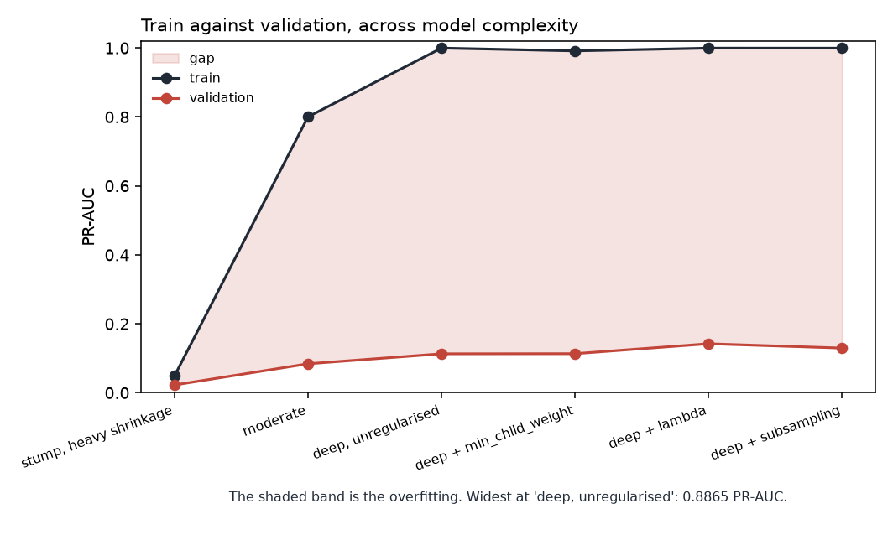

# Model results — engineered features and XGBoost

| | |
|---|---|
| Generated by | `python -m src.models.train` |
| Horizon | H=1 (calendar basis) — a pipeline smoke test, not the build's horizon |
| Data | **real** · snapshot `2026-09-19` · `data/processed/features/job_days_h1_calendar.parquet` |
| Panel | 21,875 rows · sha256 `7e469b9fe5b6…` |
| Code | `55652f321` on `fix/h1-rehearsal-keeps-its-own-ladder-reports` (clean) |

_Regenerate rather than edit._

## Features

17 panel-native features and 7 engineered ones: `title_seniority`, `title_is_manager`, `title_words`, `title_chars`, `location_is_remote`, `n_locations`, `salary_band`.
Every engineered feature is computed inside the pipeline by
`src.features.derive`, which is stateless — so each one exists identically
for a single posting at serve time, and none of them can leak across the
split however they are called.

The constant-predictor reference remains PR-AUC **0.0122**
on 20,655 labelled rows.

## The ladder, with the boosted rung

| model | description | pr_auc | brier | roc_auc | precision | recall |
|---|---|---|---|---|---|---|
| prior | constant base rate | 0.0141 | 0.0139 | 0.5 | 0.0141 | 1 |
| rule_older_than_30d | rule: up more than a month, so not about to close | 0.0134 | 0.0139 | 0.4724 | 0.0128 | 0.5306 |
| rule_posted_this_week | rule: fresh postings move, stale ones have stalled | 0.0152 | 0.0139 | 0.5351 | 0.0152 | 1 |
| age_ceiling | the best any age-only rule could do (deciles, non-monotone) | 0.0146 | 0.014 | 0.4671 | 0.0171 | 0.102 |
| age_only | age_days alone, logistic | 0.0145 | 0.2493 | 0.5293 | 0 | 0 |
| board_hazard | per-board historical rate | 0.015 | 0.0139 | 0.5133 | 0 | 0 |
| logistic | logistic regression, all allowed features | 0.0227 | 0.1223 | 0.5776 | 0.05 | 0.0612 |
| decision_tree | decision tree, depth-limited | 0.0213 | 0.1607 | 0.6263 | 0.0299 | 0.0408 |
| random_forest | random forest, 300 trees | 0.1415 | 0.0217 | 0.6364 | 0.1 | 0.1224 |
| xgboost | gradient boosting | 0.084 | 0.0236 | 0.6071 | 0.0667 | 0.0816 |

## Hypothesis ablation

Each row refits without the named column(s). `delta` is the validation
PR-AUC they are worth: positive means removing them hurt. Every row
shares the baseline's split, seed and preprocessing, so a delta is
attributable to the withheld columns and nothing else.

| removed | n_removed | hypothesis | val_pr_auc | delta | train_pr_auc | gap |
|---|---|---|---|---|---|---|
| nothing | 0 | — | 0.084 | 0 | 0.8001 | 0.7161 |
| title_seniority | 1 | how senior a role is relates to how long it takes to fill | 0.0823 | 0.0018 | 0.7562 | 0.6739 |
| title_is_manager | 1 | management roles have longer hiring processes | 0.0819 | 0.0021 | 0.7856 | 0.7037 |
| title_words | 1 | terse titles are boilerplate on high-volume reqs and churn faster | 0.0822 | 0.0018 | 0.804 | 0.7217 |
| title_chars | 1 | as title_words, by another measure | 0.0829 | 0.0012 | 0.7203 | 0.6374 |
| location_is_remote | 1 | remote roles draw a larger pool and close faster | 0.0835 | 0.0005 | 0.7896 | 0.7061 |
| n_locations | 1 | a posting open in several places is a wider net | 0.0837 | 0.0004 | 0.7992 | 0.7156 |
| salary_band | 1 | pay level relates to fill speed, non-linearly | 0.0839 | 0.0002 | 0.7645 | 0.6807 |
| board_size_at_t | 1 | a posting on a large board competes with more of them | 0.1003 | -0.0162 | 0.7937 | 0.6934 |
| board_growth | 1 | a board that is growing is hiring, and hiring boards close reqs | 0.087 | -0.003 | 0.7297 | 0.6427 |
| n_same_title_on_board | 1 | a title duplicated across the board is a high-volume req and churns | 0.0822 | 0.0018 | 0.8188 | 0.7366 |
| n_same_req_on_board | 1 | one requisition posted in several places closes when any of them does | 0.0832 | 0.0008 | 0.8022 | 0.719 |
| board context (all four) | 4 | board context is worth having at all — what `docs/design.md` §12 was decided on, and the closest a refit gets to what a caller actually loses | 0.101 | -0.017 | 0.7557 | 0.6547 |

### What this settles about board context (`docs/design.md` §12)

Withholding all four board columns costs **-0.0170** validation PR-AUC. The largest single board column is worth 0.0162.

Withholding all four did not hurt. On this split the board columns are worth nothing, and **§12 can drop them**: the validated model and the served model become the same object for every caller.

**But it is a refit, and the deployed model is not.** The number above says what the four columns are *worth*: a model trained without them redistributes their weight to whatever else it has. The shipped object does the opposite — it was fitted with them, and a caller who supplies none sends nulls that the training fold's imputers fill with constants, leaving fitted weights pointed at a column that no longer varies. The table below is that regime, and it is what `POST /predict` returns to a stranger.

| regime | n | pr_auc | brier | precision | recall | delta_pr_auc |
|---|---|---|---|---|---|---|
| board context supplied | 3466 | 0.084 | 0.0236 | 0.0667 | 0.0816 | 0 |
| absent, imputed | 3466 | 0.073 | 0.0731 | 0.05 | 0.0612 | 0.011 |

It does not price a caller who *can* supply them — a board owner scoring their own requisitions has all four, and for them the imputation branch never runs. Both rows are reported because the service serves both.

**Fold-level evidence.** The delta above is one draw; these are several, paired
on the fold so that both models see the same validation wave. Folds are cut
inside the **training** window — the test block is not read here, because
choosing a feature set is model selection.

| fold | pr_auc_full | pr_auc_without_board | difference |
|---|---|---|---|
| 0 | 0.066 | 0.0641 | 0.0019 |
| 1 | 0.1017 | 0.2816 | -0.1799 |
| 2 | 0.0877 | 0.2616 | -0.1739 |
| 3 | 0.0946 | 0.183 | -0.0884 |

The model *without* board context leads by +0.1101 PR-AUC, winning 3 of 4 folds. Dropping the four is not merely free, it is an improvement on this evidence — which would be worth understanding before acting on, since it suggests the columns are adding noise rather than signal.

## The deliberate overfit

Depth up and regularisation off until train and validation separate, then
one knob at a time to close the gap again.

| setting | max_depth | n_estimators | reg_lambda | min_child_weight | subsample | train_pr_auc | val_pr_auc | gap |
|---|---|---|---|---|---|---|---|---|
| stump, heavy shrinkage | 1 | 50 | 10 | — | — | 0.0489 | 0.0226 | 0.0263 |
| moderate | 4 | 400 | 1 | — | — | 0.8001 | 0.084 | 0.7161 |
| deep, unregularised | 12 | 1200 | 0 | 1 | 1 | 0.9996 | 0.113 | 0.8865 |
| deep + min_child_weight | 12 | 1200 | 0 | 30 | 1 | 0.9913 | 0.1133 | 0.878 |
| deep + lambda | 12 | 1200 | 50 | 1 | 1 | 0.9994 | 0.1421 | 0.8573 |
| deep + subsampling | 12 | 1200 | 0 | 1 | 0.6 | 0.9993 | 0.1296 | 0.8698 |

## Experiment tracking

Every family above is logged to MLflow as a parent run with one child per
variant — the ladder, the ablations, the overfit sweep, the board-context
folds and the serve-time regime. Each child records the feature subset it
actually fitted on, both cut instants and the embargo, the panel's path and
sha256, its own parameters and metrics, and the git SHA that produced them.

Tracked: **38 runs** in MLflow experiment `shelf-life`, as one parent per family with a child per variant. Each child carries its own feature subset, the split, the panel's sha256 and the git SHA.

## The gap, drawn

The sweep opens a train/validation gap and closes it one knob at a time.
A gap is a distance between two lines, and as a table it is two columns the
reader has to subtract in their head, one row at a time.

